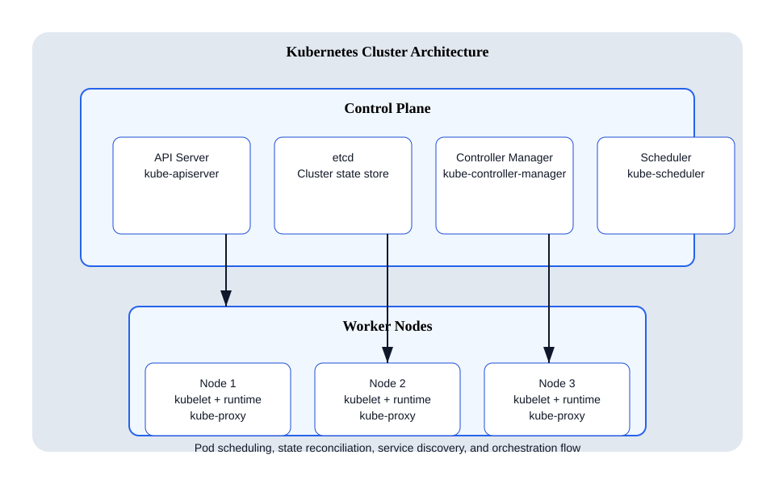

# Kubernetes Architecture

## Overview
Kubernetes is an open-source container orchestration platform designed to automate deployment, scaling, and management of containerized applications. Its architecture is based on a cluster model with two main node types:

- **Control Plane Nodes**
- **Worker Nodes**

## Control Plane
The control plane manages the cluster and makes global decisions.

### Primary control plane components
- **API Server** (`kube-apiserver`): Serves the Kubernetes API and acts as the front-end for the control plane.
- **etcd**: A distributed key-value store used to persist the cluster state.
- **Controller Manager** (`kube-controller-manager`): Runs controller processes that manage cluster state, including node lifecycle, deployment rollout, replication, and endpoints.
- **Scheduler** (`kube-scheduler`): Assigns pods to worker nodes based on resource requirements and scheduling policies.

### Control plane responsibilities
- Cluster state management
- Scheduling workloads
- Maintaining desired state
- Authentication and authorization
- Exposing Kubernetes API to users and automation tools

## Worker Node
Worker nodes host and run application containers.

### Primary worker node components
- **kubelet**: An agent that runs on each worker node and communicates with the control plane to manage pod lifecycle.
- **Container runtime**: Executes containers, such as containerd or CRI-O.
- **kube-proxy**: Handles networking for Kubernetes services, implementing load balancing and network rules.

### Worker node responsibilities
- Running pods and containers
- Reporting node and pod status to the control plane
- Managing container networking and service proxying
- Mounting and managing storage volumes for workloads

## Architecture diagram

## Separate interview reference files
- [`apply-deployment-flow.md`](apply-deployment-flow.md): step-by-step `kubectl apply -f deployment.yaml` flow
- [`control-plane-components.md`](control-plane-components.md): etcd, API Server, and Controller Manager explained
- [`control-plane-ha-vs-worker-node-ha.md`](control-plane-ha-vs-worker-node-ha.md): Control Plane HA vs Worker Node HA
- [`kubelet-vs-scheduler.md`](kubelet-vs-scheduler.md): kubelet vs scheduler
- [`scheduler-workflow.md`](scheduler-workflow.md): how the scheduler works
- [`desired-state.md`](desired-state.md): explain desired state
- [`service-discovery.md`](service-discovery.md): service discovery explained
- [`kube-proxy-routing.md`](kube-proxy-routing.md): how `kube-proxy` routes traffic to pods
- [`dns-flow.md`](dns-flow.md): Kubernetes DNS flow
- [`cni.md`](cni.md): what is CNI?
- [`cri.md`](cri.md): what is CRI?
- [`admission-controllers.md`](admission-controllers.md): what are admission controllers?
- [`authn-vs-authz.md`](authn-vs-authz.md): authentication vs authorization
- [`rolling-update.md`](rolling-update.md): how rolling update works
- [`secret-storage.md`](secret-storage.md): how Secret is stored
- [`configmap-update.md`](configmap-update.md): how ConfigMap update works
- [`ingress-architecture.md`](ingress-architecture.md): explain Ingress architecture
- [`leader-election.md`](leader-election.md): explain leader election
- [`api-server-etcd-access.md`](api-server-etcd-access.md): why API Server is the only component accessing etcd
- [`pod-lifecycle.md`](pod-lifecycle.md): complete lifecycle of a Pod
- [`pod-creation.md`](pod-creation.md): pod creation flow
- [`pod-creation-lld.md`](pod-creation-lld.md): low-level design for pod creation
- [`pod-deletion-flow.md`](pod-deletion-flow.md): what happens when a pod is deleted
- [`kube-controller-webhooks.md`](kube-controller-webhooks.md): controller manager and admission webhooks
- [`pod-failure-troubleshooting.md`](pod-failure-troubleshooting.md): troubleshooting `CrashLoopBackOff` vs `Pending`

## Architecture diagram references
For architecture diagrams and deep-dive visuals, refer to:

- Official Kubernetes architecture docs: https://kubernetes.io/docs/concepts/overview/components/
- Kubernetes control plane doc: https://kubernetes.io/docs/concepts/overview/components/#control-plane-components
- Kubernetes node doc: https://kubernetes.io/docs/concepts/architecture/nodes/

## How to use this folder
- Use this README as a starting index for Kubernetes interview prep.
- Open the separate markdown files for each conceptual question.
- Add more focused notes or diagrams as needed.
