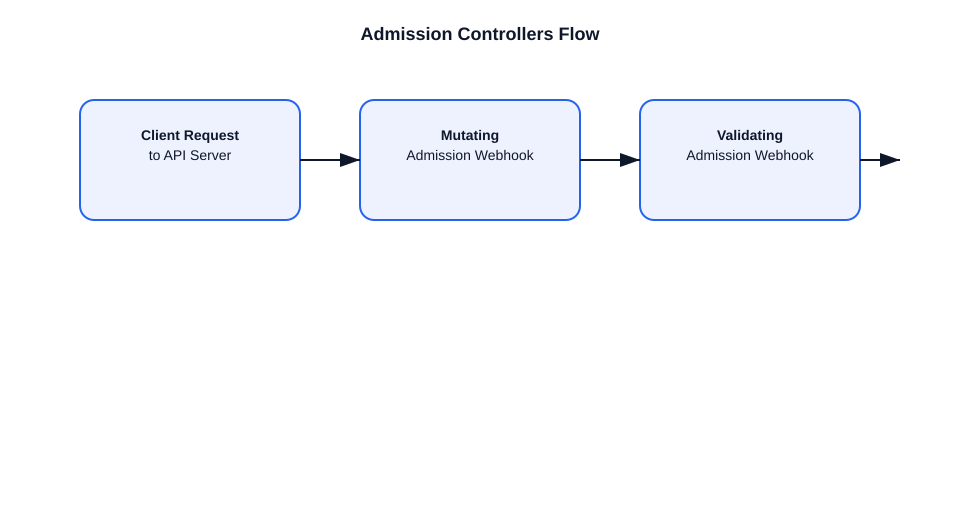

# What are Admission Controllers?

This file explains admission controllers in Kubernetes and how they enforce policies during API requests.

## Admission controller definition
- Admission controllers are plugins in the API server request pipeline.
- They intercept requests after authentication and authorization.
- They can mutate or validate objects before they are persisted.

## Types of admission controllers
- **MutatingAdmissionWebhook**: can change the incoming object.
- **ValidatingAdmissionWebhook**: approves or rejects the object.
- Built-in plugins include:
  - `NamespaceLifecycle`
  - `LimitRanger`
  - `ResourceQuota`
  - `PodSecurityPolicy` / `PodSecurityAdmission`

## Example flow
1. User submits a pod creation request.
2. API server authenticates and authorizes the request.
3. `MutatingAdmissionWebhook` runs and may inject a sidecar or default label.
4. `ValidatingAdmissionWebhook` runs and may reject the pod if policy is violated.
5. If all checks pass, the object is stored in `etcd`.

## Important points
- Admission controllers are configured in the API server.
- They are a powerful extension point for security, policy, and defaults.
- Mutating plugins run before validating plugins.
- Webhooks can be external services.

## Example
- A mutating webhook can add a logging sidecar.
- A validating webhook can require a `team` label on pod creation.

## Diagram

