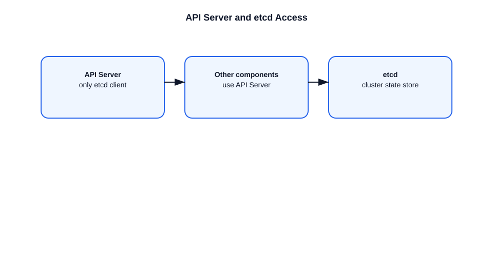

# Why is API Server the Only Component Accessing etcd?

This file explains why the kube-apiserver is the only Kubernetes component that communicates directly with `etcd`.

## API server as the gateway
- The API server provides the Kubernetes API and enforces authentication, authorization, and admission control.
- It is the central gatekeeper for all cluster state changes.
- It serializes access to `etcd` and guarantees consistency.

## Why other components do not access etcd directly
- `etcd` is a low-level storage system, not an API for controllers.
- Direct access would bypass validation, RBAC, admission checks, and audit logging.
- The API server maintains the canonical schema and versioning.

## How other components work
- Controllers, schedulers, and kubelets talk to the API server.
- They receive desired state via watches and caches.
- They write changes back through the API server.

## Important points
- Centralizing `etcd` access simplifies security and auditing.
- It avoids data corruption from incompatible clients.
- It keeps Kubernetes behavior consistent across components.
- The API server is the only component that handles object versioning and conversion.

## Interview-ready summary
- The API server is the only etcd client to enforce Kubernetes rules.
- Other components use the API server as the source of truth.
- Direct etcd access would break control plane invariants and security.

## Diagram

