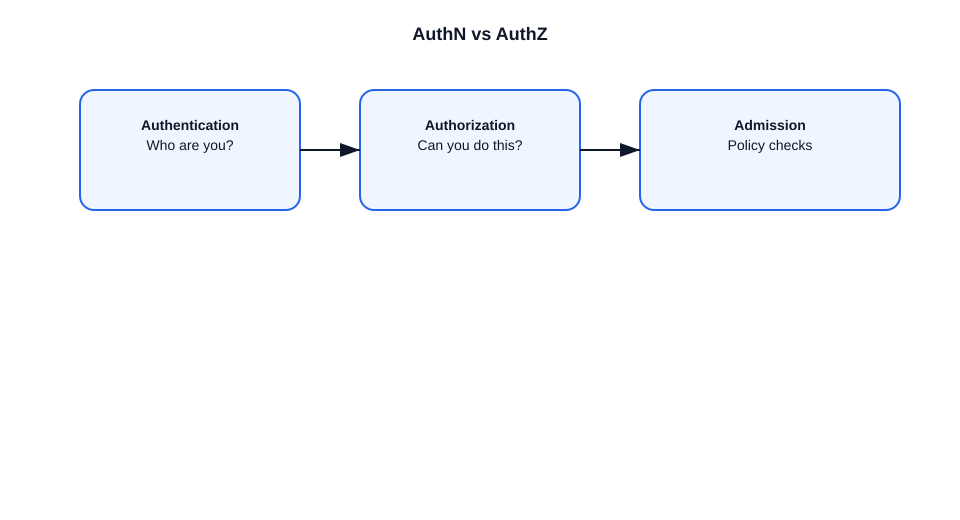

# Authentication vs Authorization in Kubernetes

This file explains the difference between authentication and authorization in Kubernetes.

## Authentication
- Authentication verifies who is making the request.
- Kubernetes supports:
  - client certificates
  - bearer tokens
  - OpenID Connect
  - service accounts
- The API server authenticates the request before any policy checks.

### Example
- A user presents a client certificate.
- The API server verifies the certificate and maps it to a user identity.

## Authorization
- Authorization checks whether the authenticated user is allowed to perform the action.
- Kubernetes supports:
  - RBAC (Role-Based Access Control)
  - ABAC (Attribute-Based Access Control)
  - Webhook authorization
  - Node authorization
- Authorization happens after authentication.

### Example
- User `alice` is authenticated.
- RBAC checks whether `alice` can create pods in the `default` namespace.
- If allowed, the request proceeds; otherwise it is denied.

## Important points
- Authentication answers `Who are you?`.
- Authorization answers `Can you do this?`.
- Both are enforced by the API server.
- A request can be authenticated but still denied by authorization.

## Diagram

