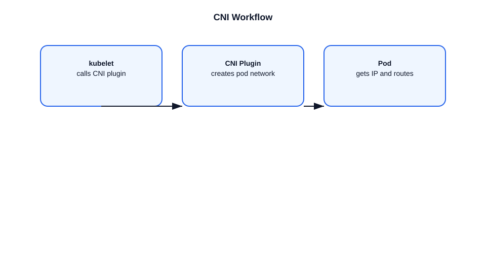

# What is CNI?

This file explains the Container Network Interface (CNI) in Kubernetes.

## CNI definition
- CNI stands for Container Network Interface.
- It is a standard for configuring networking for containers.
- Kubernetes uses CNI plugins to provide pod networking.

## Role in Kubernetes
- The kubelet calls CNI plugins when pods are created or deleted.
- CNI sets up pod network interfaces and routes.
- It provides pod IP assignment and network connectivity.

## Common CNI plugins
- `Calico`
- `Flannel`
- `Weave Net`
- `Cilium`
- `Canal`

## Example
- A pod is scheduled on a node.
- The kubelet invokes the CNI plugin with pod metadata.
- The CNI plugin creates a veth pair and assigns the pod an IP.
- The pod can now communicate with other pods across the cluster.

## Important points
- CNI is not a Kubernetes component, but a networking standard used by Kubernetes.
- Each node must run the CNI plugin binaries.
- CNI enables the flat pod network model, where every pod can reach every other pod by IP.
- Kubernetes does not enforce a single CNI; different clusters can use different plugins.

## Diagram

