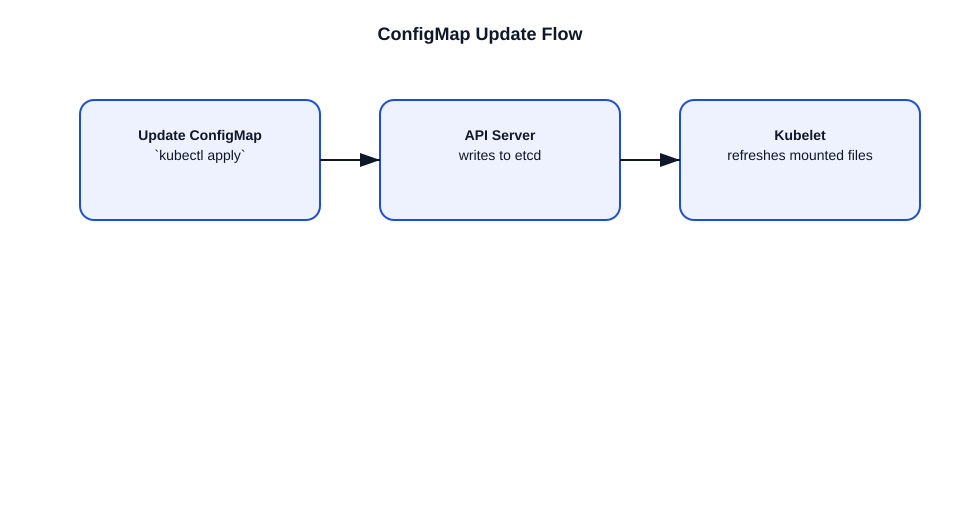

# How ConfigMap Update Works in Kubernetes

This file explains how ConfigMap updates are handled and how they affect pods.

## ConfigMap basics
- A `ConfigMap` stores configuration data as key-value pairs.
- Pods can consume ConfigMaps as environment variables, command-line arguments, or mounted files.

## Update behavior
- When a ConfigMap changes, the object in the API server is updated.
- Pods do not automatically restart unless configured to do so.
- Mounted ConfigMap files may update automatically, depending on the kubelet refresh interval.

## Consumption methods
1. **Environment variables**
   - Values are read once at pod startup.
   - Updating the ConfigMap does not change the environment variables in running containers.
2. **Mounted volume files**
   - The kubelet syncs the contents of ConfigMaps to mounted files.
   - Updates may be reflected in the pod after a short delay (usually around 1 minute).
3. **Command-line arguments**
   - Read only on container startup.
   - Requires pod restart to reflect changes.

## Example update flow
1. Update the ConfigMap with `kubectl apply -f configmap.yaml`.
2. The API server validates and stores the new ConfigMap in `etcd`.
3. The kubelet notices the ConfigMap change if it is mounted in a pod.
4. The kubelet refreshes the mounted files from the updated ConfigMap.
5. The application may read the new file contents if it watches the file.

## Important points
- ConfigMap file updates are eventually consistent and not immediate.
- Applications must handle config reloads if they rely on mounted ConfigMaps.
- For environment variables or command args, pod restart is required.
- Use `kubectl rollout restart deployment/<name>` to restart pods after config changes.

## Interview-ready summary
- ConfigMap updates are stored in `etcd` through the API server.
- Mounted files can refresh automatically on running pods.
- Environment variables and command args do not update without restart.
- Use restarts or reload-capable applications for updated config.

## Diagram

