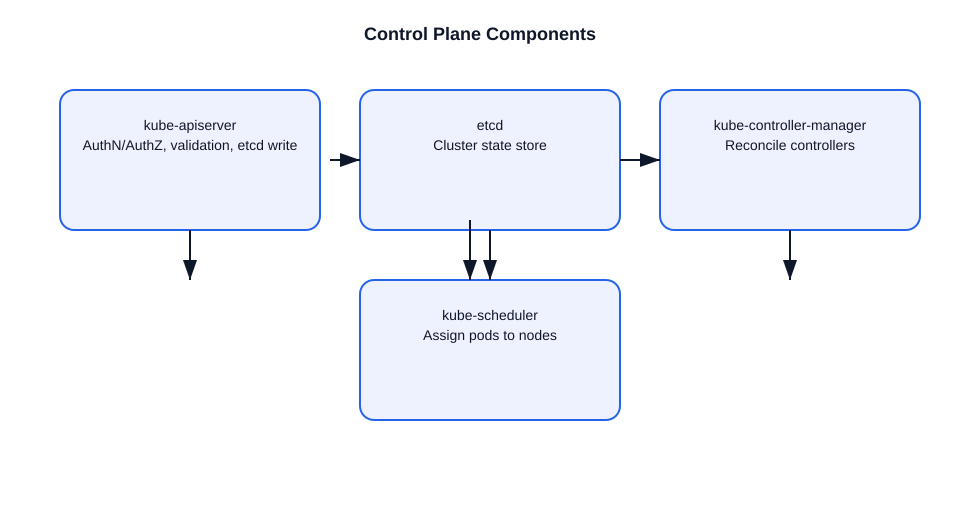

# Control Plane Components: etcd, API Server, Controller Manager

This file explains the role of the main Kubernetes control plane components and how they work together.

## etcd
- `etcd` is a distributed key-value store and the single source of truth for Kubernetes.
- It stores the cluster’s desired state, including:
  - Pods, Deployments, ReplicaSets
  - Services, ConfigMaps, Secrets
  - Nodes, Namespaces, RBAC policies
- It provides strong consistency and uses Raft for leader election and quorum.
- All writes must be persisted to `etcd` before the API server considers them successful.

### Example
- If you create a Deployment, the final object is stored in `etcd`.
- Later, controllers read from `etcd` to reconcile actual state.

## API Server
- The `kube-apiserver` is the central control plane component.
- It exposes the Kubernetes API on `https://<apiserver>:6443`.
- Responsibilities:
  - authenticate and authorize requests
  - validate and admit API objects
  - persist state to `etcd`
  - serve watch and list requests
- It is stateless and can be scaled horizontally behind a load balancer.

### Example
- `kubectl apply -f app.yaml` sends a request to the API server.
- The API server validates the manifest, runs admission checks, and writes it to `etcd`.

## Controller Manager
- The `kube-controller-manager` runs controllers that reconcile cluster state.
- Examples of controllers:
  - Node Controller
  - ReplicaSet Controller
  - Deployment Controller
  - Endpoints Controller
  - StatefulSet Controller
- Each controller is a loop:
  - watch objects from API server
  - compare desired state vs actual state
  - issue changes to move actual toward desired

### Example
- A Deployment controller creates or updates ReplicaSets.
- A ReplicaSet controller creates pods to match the desired replica count.

## How the three work together
1. User submits a request to the API server.
2. API server validates and writes the object to `etcd`.
3. Controllers read the desired state from the API server and act.
4. The kubelet on nodes reports actual state back to the API server.
5. Controllers reconcile until actual state matches desired state.

## Important points
- `etcd` is critical because it stores persistent cluster state.
- API server is the only component that reads from and writes to `etcd` directly.
- Controller manager uses the API server, not `etcd`, to observe and change state.
- The API server is the control plane gateway; controllers and schedulers all go through it.

## Diagram

