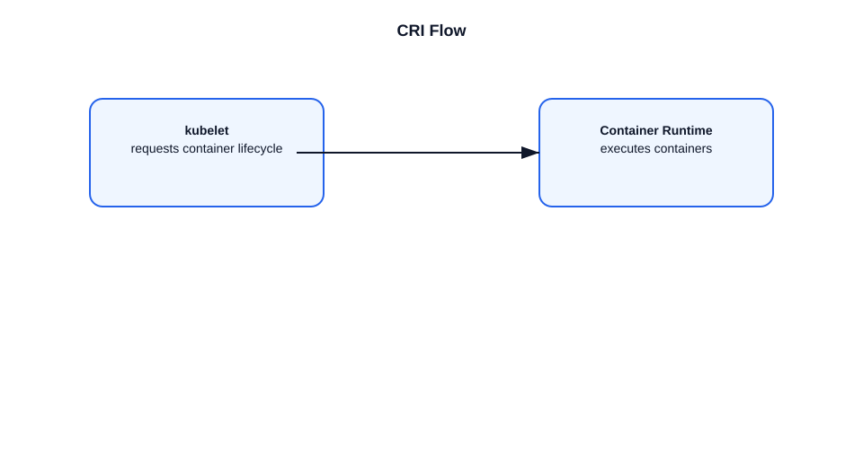

# What is CRI?

This file explains the Container Runtime Interface (CRI) used by Kubernetes to interact with container runtimes.

## CRI definition
- CRI stands for Container Runtime Interface.
- It is a standard API between the kubelet and container runtimes.
- Kubernetes uses CRI so different runtimes can be supported without changing kubelet.

## How CRI works
- The kubelet communicates with the runtime through a gRPC API.
- The runtime provides functions such as:
  - `CreateContainer`
  - `StartContainer`
  - `StopContainer`
  - `RemoveContainer`
  - `PullImage`
  - `ListImages`
- The runtime is responsible for image management, container lifecycle, and networking integration.

## Common CRI runtimes
- `containerd`
- `CRI-O`
- `Mirantis Container Runtime`

## Example flow
1. Kubelet receives a pod spec from the API server.
2. Kubelet calls the CRI runtime to pull the container image.
3. Kubelet asks the runtime to create and start the container.
4. The runtime reports status back to kubelet.

## Important points
- CRI allows pluggable container runtimes.
- The kubelet delegates container operations to the runtime.
- Kubernetes core does not depend on a specific runtime implementation.
- CRI is separate from container networking (CNI) and storage.

## Diagram

