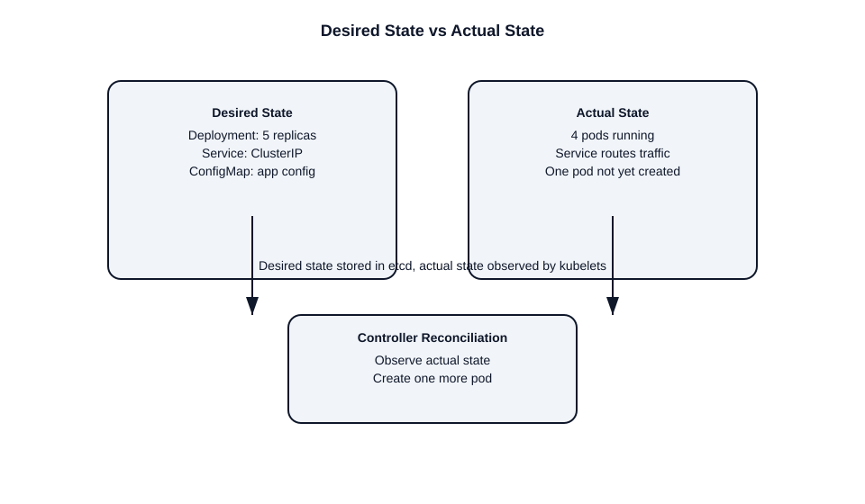

# What is Desired State in Kubernetes?

This file explains Kubernetes desired state, how it differs from actual state, and how reconciliation works.

## Desired state definition
- Desired state is the configuration expressed by Kubernetes API objects.
- It is the state you declare as the target for the cluster.
- Examples include:
  - a Deployment with 3 replicas
  - a Service exposing port 80
  - a ConfigMap containing application settings

## Where desired state lives
- Desired state is persisted by the API server in `etcd`.
- The object spec is the intent the cluster should achieve.
- The API server is the entry point for desired state changes.

## Actual state definition
- Actual state is the real, observed state of the cluster.
- It includes running pods, node health, container status, and network state.
- Actual state is reported by kubelets, controllers, and other agents.

## Reconciliation
- Kubernetes uses control loops to make actual state match desired state.
- A controller observes current state, compares it to desired state, and acts.
- Example: if a Deployment says 3 replicas but only 2 pods exist, the ReplicaSet controller creates another pod.

## Desired vs actual state example
- Desired: a Deployment spec with 5 replicas.
- Actual: 4 pods currently running.
- Controller action: create one more pod.

## Control loop pattern
1. Observe current state.
2. Compare with desired state.
3. Take action to reconcile differences.
4. Update status and repeat.

## Why it matters
- The Kubernetes API is declarative.
- You declare intent, not step-by-step commands.
- The control plane continuously adjusts the cluster to meet that intent.

## Interview-ready points
- Desired state is the declared cluster intent stored in API objects.
- Actual state is what is running now.
- Controllers reconcile actual to desired.
- Kubernetes is declarative, not imperative.

## Diagram

