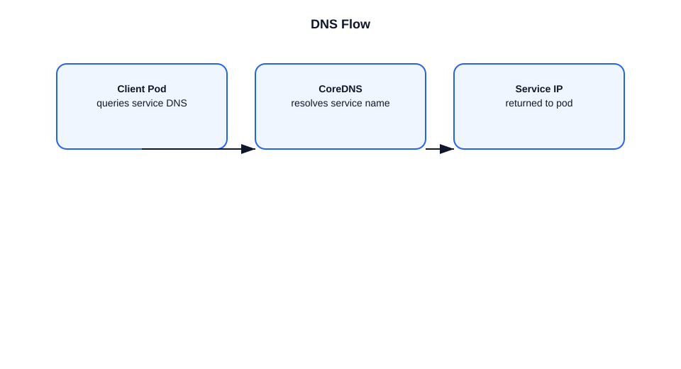

# DNS Flow in Kubernetes

This file explains how DNS works inside a Kubernetes cluster for service and pod discovery.

## DNS role
- Kubernetes DNS provides name resolution for Services and pods.
- It allows applications to use DNS names instead of IP addresses.

## Main components
- `kube-dns` or `CoreDNS`: the DNS server running as a pod.
- `kubelet`: configures pods to use the cluster DNS IP.
- `kube-proxy`: routes DNS traffic if needed.

## DNS resolution flow
1. A pod starts with `/etc/resolv.conf` configured for cluster DNS.
2. The application queries a service name like `backend.default.svc.cluster.local`.
3. The query goes to the cluster DNS service IP.
4. `CoreDNS` resolves the name from the API server or cache.
5. DNS returns the service cluster IP or pod IP(s) for headless services.

## Example
- `curl http://orders.default.svc.cluster.local`
- The pod’s DNS resolver sends a query to `10.96.0.10`.
- CoreDNS returns the cluster IP for `orders`.

## Important points
- DNS is configured automatically by the kubelet.
- Service names are namespaced: `name.namespace.svc.cluster.local`.
- Headless services return endpoint pod IPs directly.
- DNS caching and TTLs affect how quickly name changes propagate.

## Diagram

