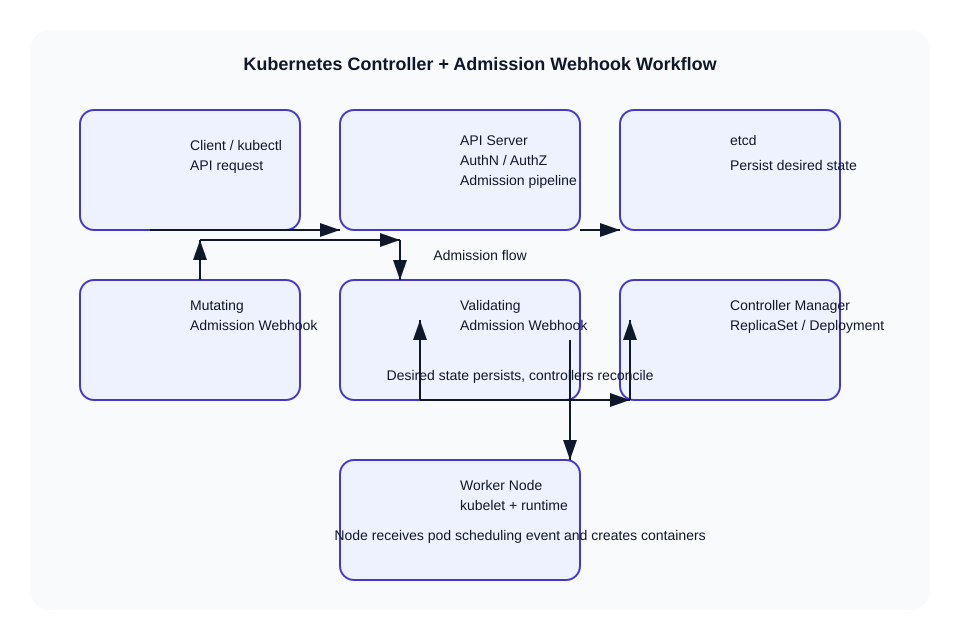

# Kubernetes Controller and Webhook Workflow

This file explains how the Kubernetes controller manager works, and how mutating and validating admission webhooks fit into the API server request flow.

## Kubernetes Controller Manager

The `kube-controller-manager` runs multiple controller loops that manage cluster state.

### Key concepts
- **Controller**: a control loop that watches the desired state, observes current state, and makes changes to move actual state toward desired state.
- **Desired state**: objects submitted to the API server, stored in `etcd`.
- **Actual state**: the real cluster state observed by controllers and kubelets.
- **Reconciliation**: controllers compare desired and actual state, then act to converge them.

### Common controllers
- `NodeController`: monitors node health and updates node status.
- `ReplicationController` / `ReplicaSet`: ensures a specified number of pod replicas.
- `DeploymentController`: manages rollout and rollback of deployments.
- `DaemonSetController`: ensures pods run on selected nodes.
- `StatefulSetController`: manages stateful workloads.
- `JobController` / `CronJobController`: runs batch jobs.
- `EndpointController`: populates service endpoints.

## Controller architecture

1. Watch objects from the API server using an informer.
2. Cache object state locally for efficient reads.
3. Add changed objects to a work queue.
4. Process items from the queue.
5. Reconcile desired and actual state.
6. Update objects via the API server.

### Control loop example

- Watch for new or changed `ReplicaSet` objects.
- Compare current pod count to the desired replica count.
- Create or delete pods to match desired replicas.
- Update status fields on the `ReplicaSet` object.

### Reconciliation pattern

```text
desired state = API server object spec
actual state  = current cluster state
if actual state != desired state:
  take action to correct state
```

## How the controller manager works

### Informers and work queues
- Informers watch resources and keep a local cache.
- Events are translated into work queue items.
- The controller worker pulls from the queue and reconciles objects.
- If reconciliation fails, the item is requeued with backoff.

### Leader election
- In HA clusters, multiple controller manager instances may run.
- Leader election ensures only one instance acts on controllers at a time.
- The elected leader owns controller operations.

### Example: ReplicaSet controller flow

1. A new `Deployment` is created.
2. The `DeploymentController` creates or updates a `ReplicaSet`.
3. The `ReplicaSetController` sees the desired replicas.
4. It compares the current number of pods owned by the ReplicaSet.
5. It creates missing pods or deletes extra pods.
6. It updates the `ReplicaSet` status.

## Admission webhooks

Admission webhooks run inside the API server request pipeline before objects are persisted.

### Types of admission webhooks
- **MutatingAdmissionWebhook**: can modify the object before validation and persistence.
- **ValidatingAdmissionWebhook**: approves or rejects the object after all mutations.

### Admission order
1. Authentication and authorization.
2. Request is decoded into an API object.
3. `MutatingAdmissionWebhook` plugins run in configured order.
4. Mutated object is recomputed and validated.
5. `ValidatingAdmissionWebhook` plugins run.
6. Object is admitted and written to `etcd`.

### When webhooks are invoked
- Creating or updating resources like Pods, Deployments, Services.
- Deleting resources when `AdmissionReview` deletion hooks are enabled.
- During object mutation or policy validation.

## Example webhook use cases

### Mutating webhook example: inject sidecar
A mutating webhook can automatically add a sidecar container to pod specs.

```yaml
apiVersion: admissionregistration.k8s.io/v1
kind: MutatingWebhookConfiguration
metadata:
  name: add-sidecar-mutating-webhook
webhooks:
  - name: sidecar.example.com
    clientConfig:
      service:
        name: sidecar-injector
        namespace: kube-system
        path: "/inject"
      caBundle: <base64-ca-cert>
    rules:
      - apiGroups: [""]
        apiVersions: ["v1"]
        operations: ["CREATE"]
        resources: ["pods"]
    admissionReviewVersions: ["v1", "v1beta1"]
    sideEffects: None
```

The webhook service receives an `AdmissionReview` request and can return a mutated pod object with an extra sidecar container.

### Validating webhook example: require labels
A validating webhook can reject pods that do not include required labels.

```yaml
apiVersion: admissionregistration.k8s.io/v1
kind: ValidatingWebhookConfiguration
metadata:
  name: require-team-label
webhooks:
  - name: validate-labels.example.com
    clientConfig:
      service:
        name: label-validator
        namespace: kube-system
        path: "/validate"
      caBundle: <base64-ca-cert>
    rules:
      - apiGroups: [""]
        apiVersions: ["v1"]
        operations: ["CREATE", "UPDATE"]
        resources: ["pods"]
    admissionReviewVersions: ["v1", "v1beta1"]
    sideEffects: None
```

The webhook checks the incoming pod spec and returns `Allowed: false` with a message if labels are missing.

## Example pod workflow with webhooks

```text
Client -> API Server: create Pod request
API Server -> AuthN/AuthZ: verify identity and permissions
API Server -> MutatingWebhook: mutate pod spec
MutatingWebhook -> API Server: return mutated object
API Server -> ValidatingWebhook: validate current pod object
ValidatingWebhook -> API Server: approve or reject
API Server -> etcd: persist object
API Server -> ControllerManager: notify controllers
ControllerManager -> ReplicaSetController: ensure replicas
ControllerManager -> Kubelet: watch pod creation event
Kubelet -> Runtime: create pod containers
Kubelet -> API Server: pod status update
```

## Diagram



## Interview talking points

- The controller manager is the brain that continuously reconciles desired state.
- Controllers are stateless and idempotent; they can retry safely.
- Admission webhooks extend API server behavior without changing core code.
- Mutating webhooks run before validating webhooks.
- Webhooks can enforce policy, inject defaults, and guard cluster compliance.

## References
- Controller manager overview: https://kubernetes.io/docs/concepts/overview/components/#kube-controller-manager
- Controllers concept: https://kubernetes.io/docs/concepts/architecture/controller/
- Admission controllers: https://kubernetes.io/docs/reference/access-authn-authz/admission-controllers/
- Admission webhooks: https://kubernetes.io/docs/reference/access-authn-authz/extensible-admission-controllers/
