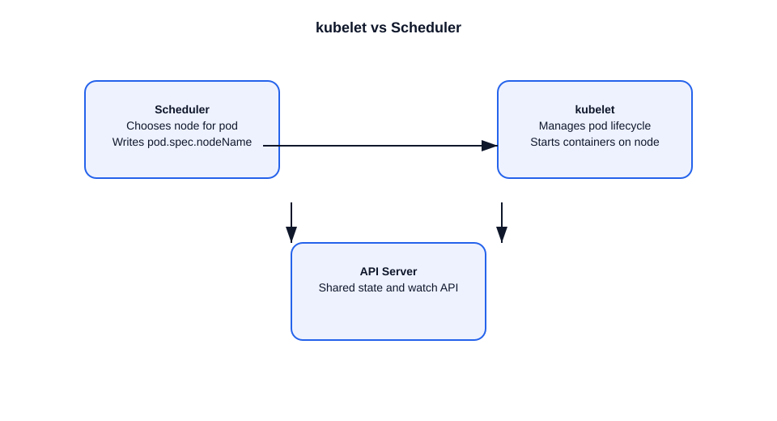

# kubelet vs Scheduler

This file compares the kubelet and scheduler roles, and explains how they work together.

## What the scheduler does
- The scheduler runs in the control plane.
- It assigns unscheduled pods to nodes.
- It decides where a pod should run based on:
  - resource requests (CPU, memory)
  - node selectors, affinity/anti-affinity
  - taints and tolerations
  - topology spread and zone constraints
- It writes the chosen node into `pod.spec.nodeName`.

### Example
- A new pod is created with no node assigned.
- The scheduler selects `node-1` and binds the pod there.

## What the kubelet does
- The kubelet runs on each worker node.
- It monitors and manages pods scheduled to its node.
- It ensures containers are created, healthy, and running.
- It reports pod and node status back to the API server.

### Example
- The scheduler assigns a pod to `node-1`.
- The kubelet on `node-1` pulls images, starts containers, and reports status.

## Key differences
- Scheduler = placement decision.
- Kubelet = pod lifecycle execution.
- Scheduler is control plane; kubelet is data plane.
- Scheduler works with API objects; kubelet interacts with container runtime.

## How they collaborate
1. Pod is created without `spec.nodeName`.
2. Scheduler chooses a node and updates the pod object.
3. API server persists the assignment.
4. Kubelet on the assigned node sees the pod and starts it.

## Important notes
- The scheduler does not create containers.
- The kubelet does not choose nodes.
- Scheduling happens once per pod placement.
- Kubelet continues managing pods after scheduling.

## Diagram

