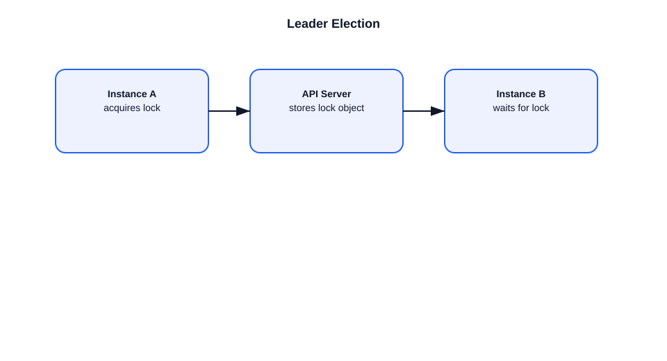

# Leader Election in Kubernetes

This file explains leader election in Kubernetes and why it is important for HA components.

## What is leader election?
- Leader election allows multiple instances of a component to run, with only one acting at a time.
- It prevents duplicate work and ensures consistent cluster behavior.

## Where it is used
- `kube-controller-manager`
- `kube-scheduler`
- custom controllers built with leader election support

## How it works
- Instances create a lock object in the API server.
- The current leader holds the lock by periodically renewing it.
- If the leader fails to renew, another instance acquires the lock.

## Example flow
1. Two controller manager replicas start.
2. One acquires the leadership lock in the API server.
3. The leader processes controllers.
4. If the leader crashes, the lock expires.
5. The remaining instance becomes the new leader.

## Important points
- Leader election is typically implemented using ConfigMaps or Endpoints as lock objects.
- It uses the API server as a coordination point.
- It allows HA without running duplicate reconciliation logic.
- Only the leader performs active control plane work.

## Interview-ready summary
- Leader election ensures only one controller or scheduler instance is active.
- It makes control plane components HA-safe.
- The API server coordinates the election using lock objects.

## Diagram

