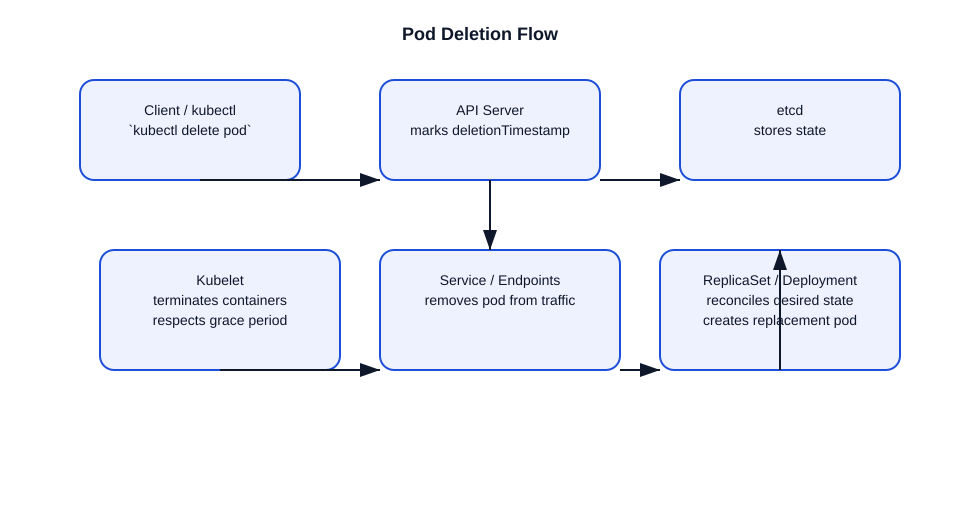

# What happens when a Pod is deleted?

This file explains the step-by-step lifecycle when a Pod deletion is requested in Kubernetes.

## 1. Deletion request is sent
- A user runs `kubectl delete pod <name>` or another controller issues a delete operation.
- The API request is sent to the `kube-apiserver`.

## 2. API Server processes the delete
- The API server authenticates and authorizes the delete request.
- Admission controllers may run, including webhooks configured for delete events.
- If allowed, the API server updates the Pod object with `metadata.deletionTimestamp` and `metadata.finalizers` if any.
- The Pod enters the `Terminating` state.

## 3. Graceful termination begins
- The kubelet on the node where the pod is running sees the deletion timestamp.
- It begins graceful shutdown of containers:
  - sends `SIGTERM` to each container’s process
  - waits up to the pod’s `terminationGracePeriodSeconds`
- Containers may perform cleanup before exit.

## 4. Pod is removed from service endpoints
- `kube-proxy` and endpoint controllers remove the pod from its Service endpoints.
- New traffic stops being routed to the terminating pod.

## 5. Finalizers and additional cleanup
- If the Pod has finalizers, deletion is paused until they are removed.
- Common finalizers include volume cleanup or custom controller cleanup logic.
- The Pod remains in `Terminating` until finalizers are cleared and containers stop.

## 6. Pod object removal
- Once containers are terminated and finalizers are gone, the API server deletes the Pod object from `etcd`.
- The Pod disappears from API lookups.

## 7. Controllers reconcile desired state
- If the pod was owned by a `ReplicaSet` or `Deployment`, the controller sees the replica count is below desired.
- The controller creates a replacement Pod to maintain the desired state.
- This demonstrates the difference between a single pod deletion and a managed workload.

## Important details
- Pod deletion does not imply workload deletion for higher-level controllers.
- The kubelet is responsible for actual container termination on the node.
- `metadata.deletionTimestamp` marks a graceful delete in progress.
- `Terminating` is a transient state while cleanup completes.

## Interview-ready summary
- Delete request hits API server.
- API server marks the pod for termination and updates `etcd`.
- Kubelet terminates containers, services remove the pod from traffic.
- The pod is deleted once cleanup finishes.
- Controllers may recreate the pod if it is part of a replica-managed set.

## Diagram

