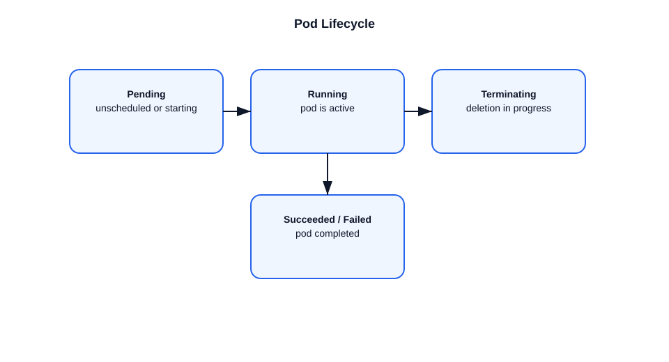

# Complete Lifecycle of a Pod in Kubernetes

This file explains the full lifecycle of a Pod from creation to termination.

## Pod lifecycle phases
- `Pending`
- `Running`
- `Succeeded`
- `Failed`
- `Unknown`

## Pod creation flow
1. A pod manifest is submitted to the API server.
2. The API server validates and stores the pod in `etcd`.
3. The scheduler assigns a node by setting `spec.nodeName`.
4. The kubelet on the assigned node creates the pod sandbox and containers.
5. The container runtime starts containers.
6. The kubelet updates pod status to `Running`.

## Pod running state
- The pod stays `Running` while containers are healthy.
- Readiness probes affect service traffic eligibility.
- Liveness probes can restart containers if they fail.

## Pod termination flow
1. Pod deletion request is received by the API server.
2. The pod is marked `Terminating` and `deletionTimestamp` is set.
3. The kubelet sends `SIGTERM` to containers.
4. Containers stop or are forcibly killed after the grace period.
5. The pod object is removed from `etcd`.

## Pod lifecycle details
- `Pending` means the pod is accepted but not yet running.
- `ContainerCreating` is an intermediate status during startup.
- `CrashLoopBackOff` indicates repeated container restarts.
- `Succeeded` means all containers completed successfully.
- `Failed` means at least one container exited with failure and will not restart.

## Important points
- A pod is ephemeral; it is not rescheduled after termination.
- Higher-level controllers recreate pods if needed.
- Pod status is continuously reported by kubelet.
- The pod lifecycle is controlled by both the control plane and kubelet.

## Diagram

