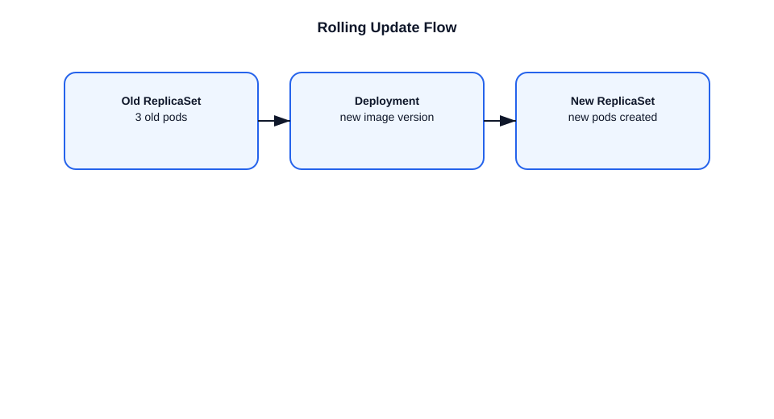

# How Rolling Update Works in Kubernetes

This file explains how Kubernetes performs rolling updates for Deployments.

## Rolling update definition
- A rolling update replaces old pod replicas with new ones gradually.
- It allows application updates with minimal downtime.

## Rolling update strategy
- `maxUnavailable`: how many old pods can be down during the update.
- `maxSurge`: how many extra pods can be created above the desired count.

## Example
- Desired replicas: 5
- `maxUnavailable: 1`
- `maxSurge: 1`
- The controller may create 6 pods temporarily while deleting one old pod.

## Update flow
1. The Deployment spec changes (new image, env var, etc.).
2. The Deployment controller creates a new ReplicaSet.
3. It scales up the new ReplicaSet and scales down the old one.
4. Pods are updated incrementally based on the strategy.
5. The update finishes when all old pods are replaced and the desired count is met.

## Important points
- Rolling updates are controlled by the Deployment controller.
- Readiness probes determine when a new pod is considered available.
- If the new pod fails, the rollout can pause or roll back.
- `kubectl rollout status deployment/<name>` shows progress.

## Diagram

