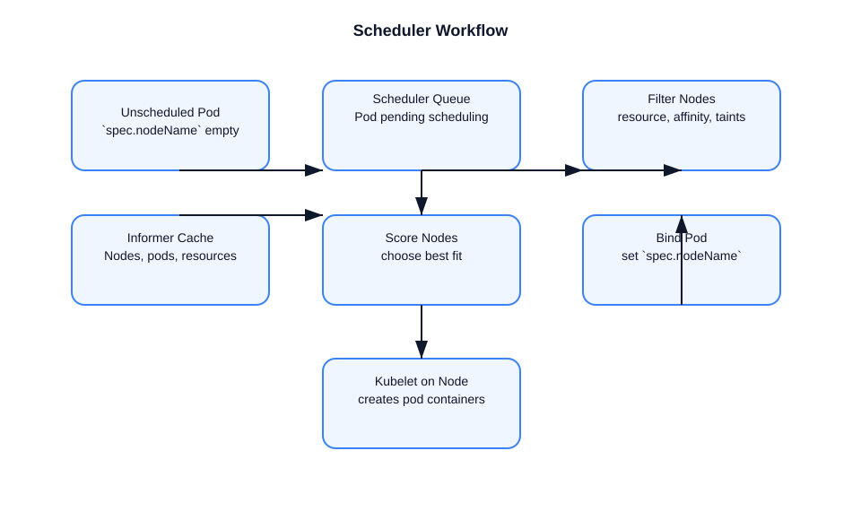

# How the Kubernetes Scheduler works

This file explains the scheduler’s role, internal flow, and decision-making process.

## Scheduler purpose
- The scheduler assigns unscheduled pods to nodes.
- It ensures pods are placed on nodes that satisfy resource, affinity, topology, and policy constraints.
- It does not create containers; it only binds pods to nodes.

## Core components
- **Scheduler cache**: stores current objects from the API server.
- **Informers**: watch pods, nodes, and other resources.
- **Scheduling queue**: holds unscheduled pods for processing.
- **Predicates / filters**: eliminate unsuitable nodes.
- **Priorities / scoring**: rank remaining nodes.
- **Binder**: sets `spec.nodeName` on the pod.

## Scheduling flow

### 1. Pod enters the scheduler queue
- A pod is created without `spec.nodeName`.
- The scheduler sees the unscheduled pod event.
- The pod enters the scheduling queue.

### 2. Filter nodes
- The scheduler evaluates each candidate node against constraints:
  - resource requests and allocatable capacity
  - node selectors, node affinity, pod affinity/anti-affinity
  - taints and tolerations
  - node conditions and readiness
  - topology spread constraints
  - volume binding requirements

### 3. Score nodes
- The scheduler scores the filtered nodes.
- It uses priorities such as:
  - bin-packing or balanced resource usage
  - topology spread
  - preferred affinity rules
- The highest-scoring node is chosen.

### 4. Bind the pod
- The scheduler writes `spec.nodeName` to the pod object.
- This is called the bind operation.
- The kubelet on that node receives the update and begins pod creation.

### 5. Handle failures
- If no node is suitable, the pod remains unscheduled.
- The scheduler retries as cluster state changes.
- If preemption is enabled, it may evict lower-priority pods to make room.

## Scheduling details

### Informers and cache
- The scheduler keeps a local cache of nodes, pods, and other resources.
- Informers reduce API server load and keep state fresh.
- The scheduler uses the cache when filtering and scoring.

### Extensibility
- Kubernetes scheduler is pluggable with scheduling framework plugins.
- Custom policies can be added without changing core scheduler code.
- Examples: custom predicates, priority functions, and preemption behavior.

### Failure detection / backoff
- Scheduling failures are requeued with backoff.
- The scheduler reacts to node and pod updates.
- Unscheduled pods are continuously retried until placed or deleted.

## Interview-ready summary
- The scheduler is a control plane component that assigns a node to a pod.
- It uses filters and scoring to choose the best available node.
- It does not start containers; the kubelet does.
- Scheduling is based on resource requests, affinity, taints, topology, and more.
- Once bound, the pod is handed off to the kubelet for execution.

## Diagram

