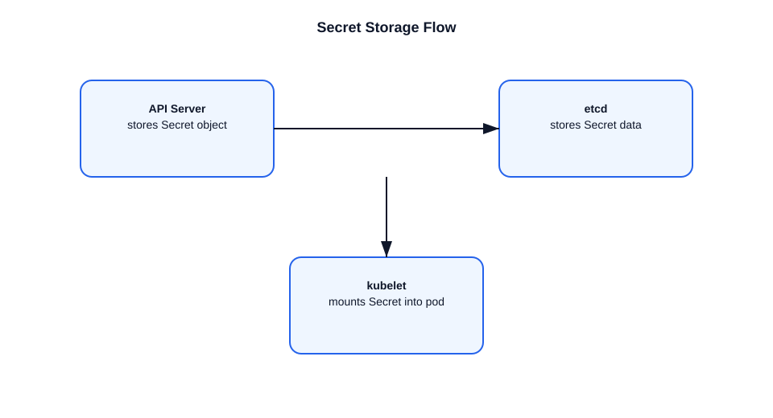

# How Secrets Are Stored in Kubernetes

This file explains how Kubernetes stores Secrets and what to note about security.

## Secret storage in Kubernetes
- Secrets are stored as API objects in `etcd`.
- By default, data is Base64 encoded, not encrypted.
- The API server reads and writes Secrets to `etcd` like any other object.

## Example
- A Secret object contains `data` fields such as `username` or `password`.
- The kubelet may mount the Secret as a file or expose it as environment variables.

## Important points
- Base64 is not encryption; it is encoding.
- For real protection, enable `EncryptionConfiguration` in the API server.
- Limit RBAC access to Secrets.
- Avoid storing Secrets in pod specs or images.

## Encryption example
- With encryption at rest enabled, the API server encrypts Secret data before writing to `etcd`.
- The KMS or local key decrypts it when the object is read.

## Diagram

