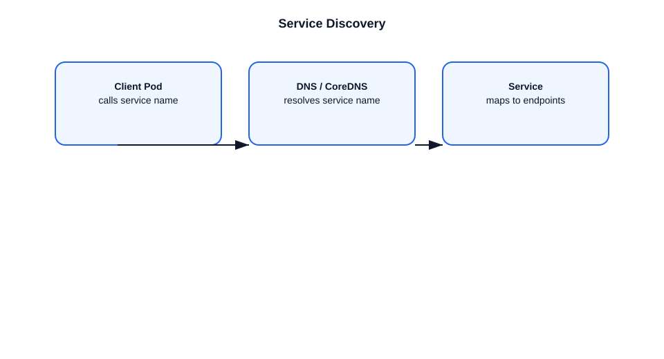

# Service Discovery in Kubernetes

This file explains how Kubernetes service discovery works and how applications find one another.

## What is service discovery?
- Service discovery lets applications resolve and connect to services dynamically.
- In Kubernetes, Services provide stable access to a set of pods.
- Service discovery usually happens via DNS or environment variables.

## Service object
- A Service is an API object with a stable `clusterIP`.
- It selects pods using labels.
- It provides load balancing across matching pod endpoints.

### Example
- A `frontend` pod can call `http://backend.default.svc.cluster.local`.
- Kubernetes DNS resolves that name to the Service cluster IP.

## How it works
1. Create a Service object with a selector and ports.
2. Kubernetes creates an `Endpoints` object listing pod addresses.
3. `kube-proxy` programs node networking to route traffic to endpoints.
4. DNS resolves service names to `clusterIP`.
5. Clients use the service name, not pod IPs.

## Service discovery methods
- **DNS**: most common method.
- **Environment variables**: injected into pods at creation time.
- **Direct API lookup**: applications can query the API server.

## Important points
- Service names are stable, pods are ephemeral.
- A Service decouples clients from pod lifecycle changes.
- `kube-proxy` and DNS work together to make service discovery reliable.
- Headless services skip `clusterIP` and return pod IPs directly.

## Diagram

