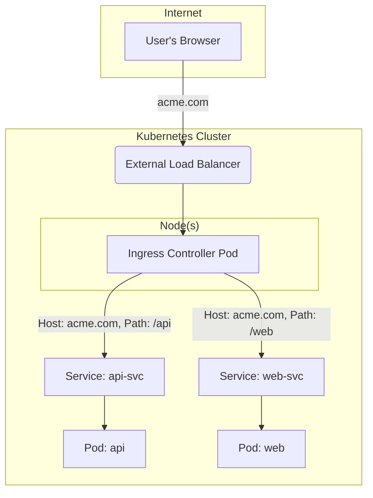

# Ingress Architecture in Kubernetes

This file explains Kubernetes Ingress architecture and how it routes external traffic.

## What is Ingress?
- `Ingress` is an API object that defines HTTP/S routing rules for external traffic.
- It provides a single entry point to services in a cluster.

## Components involved
- **Ingress resource**: defines host/path rules.
- **Ingress controller**: implements the rules and configures a load balancer or proxy.
- **Service**: backends referenced by the Ingress.
- **LoadBalancer / NodePort**: exposes the Ingress controller externally.

## Example flow
1. User creates an `Ingress` object with rules like `/api` and `/web`.
2. The Ingress controller watches the object via the API server.
3. The controller updates its proxy configuration.
4. External requests arrive at the Ingress controller endpoint.
5. The controller routes traffic to the appropriate Service.

## High-Level Design Diagram

This diagram shows how external traffic flows through the Ingress controller to reach different services based on the requested path.

## Important points
- Ingress is only the rule object; the controller does the actual traffic handling.
- Different controllers exist: NGINX, Traefik, HAProxy, Istio, etc.
- TLS can be terminated at the Ingress controller.
- Ingress can also support rewrites, redirects, and virtual hosts.

## Interview-ready summary
- Ingress provides HTTP/S routing rules.
- The Ingress controller implements those rules.
- Services remain the cluster-internal backends.
- Ingress is the bridge between external traffic and internal services.

## Quick Quiz
1.  **Question:** If you delete an `Ingress` resource, what happens to the external traffic?
    **Answer:** The Ingress controller will remove the routing rules. Existing connections may drop, and new requests for those rules will result in an error (e.g., 404) from the controller. The controller itself continues running.
2.  **Question:** Can an Ingress controller run without a `Service` of type `LoadBalancer`?
    **Answer:** Yes. The controller's Pods can be exposed via a `NodePort` service or even `hostPort`, although a `LoadBalancer` is the most common and robust method for cloud environments.
3.  **Question:** What is the key difference between an `Ingress` resource and an `IngressClass` resource?
    **Answer:** The `Ingress` resource defines the *routing rules* (what to do with traffic). The `IngressClass` resource defines *which controller* should implement those rules, along with controller-specific configuration.

<!-- 
This diagram is a placeholder. For a real document, you would generate an SVG or PNG from the Mermaid code.
!Ingress architecture 
-->
