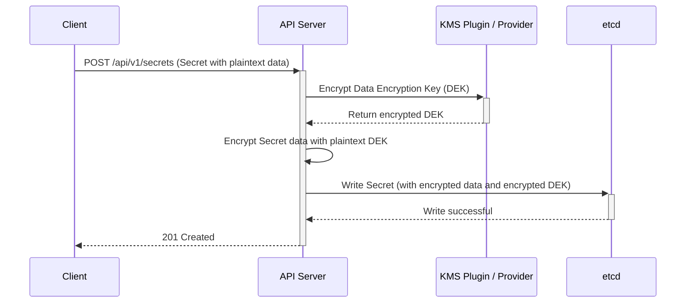

# How Secrets Are Stored in Kubernetes

This file explains how Kubernetes stores Secrets and what to note about security.

## Secret storage in Kubernetes
- Secrets are stored as API objects in `etcd`.
- By default, data is Base64 encoded, not encrypted.
- The API server reads and writes Secrets to `etcd` like any other object.

## Example
- A Secret object contains `data` fields such as `username` or `password`.
- The kubelet may mount the Secret as a file or expose it as environment variables.

## Important points
- Base64 is not encryption; it is encoding.
- For real protection, enable `EncryptionConfiguration` in the API server.
- Limit RBAC access to Secrets.
- Avoid storing Secrets in pod specs or images.

## Encryption example
- With encryption at rest enabled, the API server encrypts Secret data before writing to `etcd`.
- The KMS or local key decrypts it when the object is read.

## Secret Encryption-at-Rest Flow (LLD)

This diagram shows the flow when a client creates a Secret with encryption-at-rest configured for the API server.

## Quick Quiz
1.  **Question:** A user runs `kubectl get secret my-secret -o yaml`. The data appears as a long, random-looking string. Is it encrypted?
    **Answer:** Not necessarily. It is Base64 encoded by default. You cannot tell if it's encrypted in `etcd` just by looking at the `kubectl` output, as the API server decrypts it before sending it to the client.
2.  **Question:** What is the most significant risk of not enabling encryption at rest?
    **Answer:** If an attacker gains read access to the `etcd` backup files or the `etcd` data directory, they can read all Secret data in cleartext (after Base64 decoding).
3.  **Question:** Which is more secure for a Pod: mounting a Secret as an environment variable or as a volume?
    **Answer:** Mounting as a volume is generally more secure. Environment variables can be accidentally leaked via logs, shell history, or child processes, whereas file permissions on a volume are easier to control.
