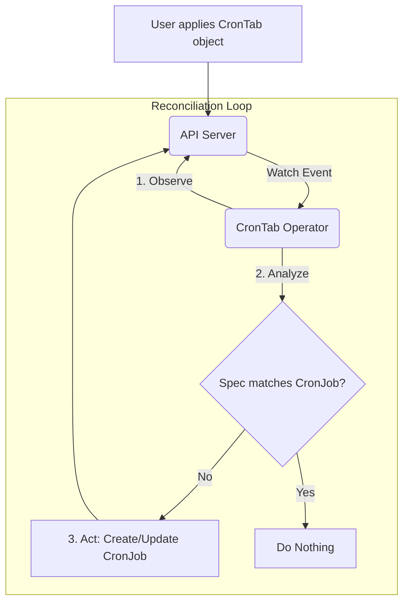

# Custom Resources (CRDs)

A **Custom Resource Definition (CRD)** is a powerful feature that allows you to extend the Kubernetes API by defining your own custom object types. Once you create a CRD, you can create and manage instances of that object using `kubectl`, just like you would for built-in resources like `Pods` or `Deployments`.

CRDs are the foundation of the **Operator Pattern**, where you write a custom controller to manage the lifecycle of your custom resources.

## How it Works

1.  **Define the CRD**: You create a `CustomResourceDefinition` manifest. This manifest specifies the name, scope (namespaced or cluster-wide), and schema of your new resource.
2.  **Create the CRD**: You apply the manifest to your cluster. The Kubernetes API server sees this and creates a new API endpoint for your resource (e.g., `/apis/mycompany.com/v1/namespaces/*/crontabs`).
3.  **Create Custom Objects**: You can now create instances of your custom resource by writing a YAML manifest with the `kind` and `apiVersion` you defined.
4.  **Write a Controller (Optional but Recommended)**: To make your custom resource useful, you typically write a custom controller (an "Operator") that watches for create/update/delete events for your custom objects and performs actions to reconcile the desired state.

---

## The Operator Pattern

An **Operator** is a custom Kubernetes controller that uses CRDs to manage an application and its components. It encodes human operational knowledge into software. Think of it as a robotic site reliability engineer (SRE) for your application.

The core of an operator is a **reconciliation loop**:
1.  **Observe**: Watch the current state of your custom resources (e.g., a `CronTab` object).
2.  **Analyze**: Compare the desired state (from the CR's `spec`) with the actual state of the cluster (e.g., are the correct `CronJob` objects running?).
3.  **Act**: Take actions to make the actual state match the desired state. For our `CronTab` example, this would mean creating, updating, or deleting underlying `CronJob` objects to match the `spec`.



## Practical Example: A Simple `CronTab` CRD

Let's create a custom resource called `CronTab` that specifies a cron schedule and an image to run.

### 1. Define the CustomResourceDefinition

This YAML defines the `CronTab` resource. It is namespaced, has a short name `ct`, and a simple schema requiring a `cronSpec` and `image`.

**`crd-crontab.yaml`**
```yaml
apiVersion: apiextensions.k8s.io/v1
kind: CustomResourceDefinition
metadata:
  # name must match the spec fields below, and be in the form: <plural>.<group>
  name: crontabs.mycompany.com
spec:
  # group name to use for REST API: /apis/<group>/<version>
  group: mycompany.com
  # list of versions supported by this CRD
  versions:
    - name: v1
      # Each version can be enabled/disabled by Served flag.
      served: true
      # One and only one version must be marked as the storage version.
      storage: true
      schema:
        # openAPIV3Schema is the schema for validating custom objects.
        openAPIV3Schema:
          type: object
          properties:
            spec:
              type: object
              properties:
                cronSpec:
                  type: string
                image:
                  type: string
                replicas:
                  type: integer
  # either Namespaced or Cluster
  scope: Namespaced
  names:
    # plural name to be used in the URL: /apis/<group>/<version>/<plural>
    plural: crontabs
    # singular name to be used as an alias on the CLI and for display
    singular: crontab
    # kind is normally the CamelCased singular type. Your resource manifests use this.
    kind: CronTab
    # shortNames allow shorter string to match your resource on the CLI
    shortNames:
    - ct
```

### 2. Create an Instance of the Custom Resource

Once the CRD is applied, you can create a `CronTab` object.

**`cr-my-crontab.yaml`**
```yaml
apiVersion: "mycompany.com/v1"
kind: CronTab
metadata:
  name: my-new-cron
spec:
  cronSpec: "*/5 * * * *"
  image: my-awesome-cron-image:latest
  replicas: 1
```

### 3. Manage with `kubectl`

```sh
# Apply the CRD definition
kubectl apply -f crd-crontab.yaml

# Wait a moment for the new API endpoint to become available

# Apply the custom resource instance
kubectl apply -f cr-my-crontab.yaml

# You can now manage your custom resource like any other Kubernetes object
kubectl get crontabs
# or with the short name
kubectl get ct

# Describe it
kubectl describe ct my-new-cron

# Delete it
kubectl delete ct my-new-cron
```

**Note**: Without a custom controller, creating this `CronTab` object does nothing on its own. The next step in a real-world scenario would be to build and deploy an operator that watches `CronTab` resources and creates `CronJob` objects based on their specs.