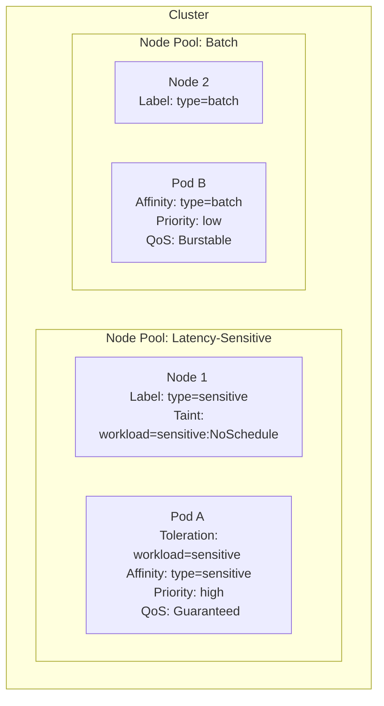

# Scheduling Use Case: Latency-Sensitive vs. Batch Workloads

A common requirement in a multi-tenant cluster is to ensure that low-priority, resource-intensive batch jobs do not interfere with latency-sensitive online services. This can be achieved by combining several Kubernetes scheduling and resource management features.

## The Strategy: Isolate, Prioritize, and Protect

1.  **Isolate Nodes**: Use taints and labels to create logical partitions for different workload types.
2.  **Prioritize Critical Workloads**: Use `PriorityClass` to allow critical pods to preempt less important ones.
3.  **Protect with QoS**: Use resource requests and limits to assign Quality of Service (QoS) classes, which influences eviction priority.



---

## Step 1: Isolate Nodes with Taints and Labels

First, prepare your nodes. We'll create two logical node pools.

```sh
# Label and taint nodes for latency-sensitive workloads
kubectl label node node-1 workload-type=sensitive
kubectl taint node node-1 workload=sensitive:NoSchedule

# Label nodes for batch workloads
kubectl label node node-2 workload-type=batch
```

-   The `NoSchedule` taint on `node-1` prevents any pod from being scheduled there unless it has a matching toleration.
-   The labels will be used by `nodeAffinity` to attract pods to the correct pool.

---

## Step 2: Create PriorityClasses

Create two priority classes: one high-priority for sensitive services and one low-priority for batch jobs.

```yaml
# high-priority.yaml
apiVersion: scheduling.k8s.io/v1
kind: PriorityClass
metadata:
  name: high-priority
value: 1000000
preemptionPolicy: PreemptLowerPriority
description: "For latency-sensitive services."
---
# low-priority.yaml
apiVersion: scheduling.k8s.io/v1
kind: PriorityClass
metadata:
  name: low-priority
value: 1000
description: "For batch jobs."
```

---

## Step 3: Configure the Workloads

### Latency-Sensitive Deployment

This Deployment is configured to run only on the `sensitive` nodes, with high priority and a `Guaranteed` QoS class.

```yaml
apiVersion: apps/v1
kind: Deployment
metadata:
  name: sensitive-app
spec:
  replicas: 2
  template:
    spec:
      priorityClassName: high-priority
      tolerations:
      - key: "workload"
        operator: "Equal"
        value: "sensitive"
        effect: "NoSchedule"
      affinity:
        nodeAffinity:
          requiredDuringSchedulingIgnoredDuringExecution:
            nodeSelectorTerms:
            - matchExpressions:
              - key: workload-type
                operator: In
                values:
                - sensitive
      containers:
      - name: app
        image: my-sensitive-app
        resources:
          requests:
            cpu: "1"
            memory: "2Gi"
          limits:
            cpu: "1"
            memory: "2Gi" # requests == limits -> Guaranteed QoS
```

### Batch Job

This Job is configured to run on the `batch` nodes with low priority and a `Burstable` QoS class.

```yaml
apiVersion: batch/v1
kind: Job
metadata:
  name: batch-job
spec:
  template:
    spec:
      priorityClassName: low-priority
      affinity:
        nodeAffinity:
          requiredDuringSchedulingIgnoredDuringExecution:
            nodeSelectorTerms:
            - matchExpressions:
              - key: workload-type
                operator: In
                values:
                - batch
      containers:
      - name: processor
        image: my-batch-processor
        resources:
          requests:
            cpu: "500m"
            memory: "1Gi"
          # No limits -> Burstable QoS
      restartPolicy: OnFailure
```

By combining these features, you create a robust scheduling policy that protects your critical services while allowing batch jobs to run efficiently on separate, appropriate hardware.