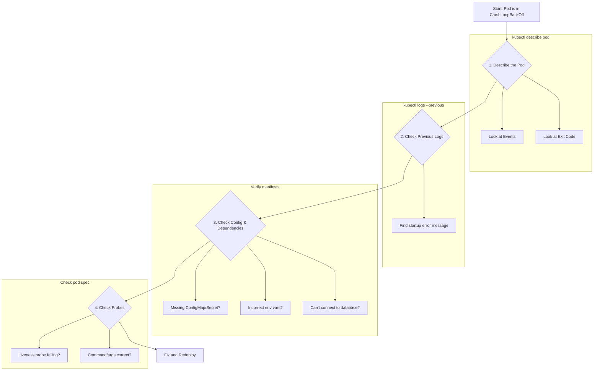

# Troubleshooting: Pod in CrashLoopBackOff

A `CrashLoopBackOff` status means that a container in your pod is repeatedly starting and then exiting with an error. The `kubelet` tries to restart it with an increasing back-off delay. This is a common issue and indicates a problem with the application or its configuration, not with Kubernetes scheduling.

## The Troubleshooting Workflow

Follow these steps in order to quickly diagnose the root cause.



### Step 1: Describe the Pod

This is the most important first step. It shows you the container's exit code and any relevant events.

```sh
kubectl describe pod <pod-name> -n <namespace>
```

Look for the `lastState` section for the crashing container. An `Exit Code` other than 0 indicates an error. Also, check the `Events` section at the bottom for messages like `Back-off restarting failed container`.

### Step 2: Check the Logs of the Previous Container

Since the current container might not have had time to log anything, you must check the logs of the *previous* crashed instance using the `--previous` flag.

```sh
kubectl logs <pod-name> -n <namespace> --previous
```

This will almost always show the application error that caused the container to exit, such as a "database connection refused," "file not found," or a stack trace.

### Step 3: Check Configuration and Dependencies

Based on the log output, the most common causes are configuration errors:
-   **Missing ConfigMap or Secret**: The pod is trying to mount a volume or environment variable from a resource that doesn't exist. `kubectl describe` will often show a `CreateContainerConfigError` in this case.
-   **Incorrect Command or Arguments**: A typo in the `spec.containers.command` or `args` in your manifest can cause the container to exit immediately.
-   **Failed Connection to a Dependency**: The application can't reach a required database or another service at startup.

### Step 4: Check Liveness Probe

A misconfigured liveness probe can cause a `CrashLoopBackOff`. If the probe fails, the `kubelet` will kill and restart the container. This can happen if:
-   The `initialDelaySeconds` is too short for a slow-starting application.
-   The probe's endpoint, command, or port is incorrect.

If you suspect a bad probe, you can temporarily remove the `livenessProbe` from your manifest and re-apply it to see if the pod becomes stable. If it does, your probe needs to be adjusted.