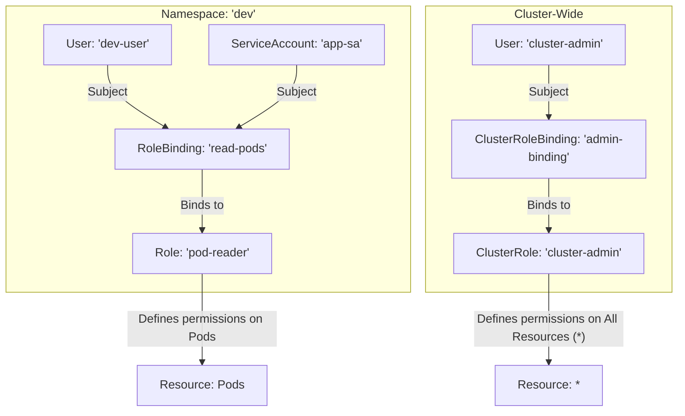

# Role-Based Access Control (RBAC)

**Role-Based Access Control (RBAC)** is the standard mechanism in Kubernetes for controlling who can access which API resources. It allows you to grant granular permissions to users and service accounts.

## Core RBAC Objects

RBAC is built on four main object types:

-   **Role**: A set of permissions within a specific **namespace**. It defines rules that grant access to a set of resources. A Role cannot grant access to cluster-scoped resources (like Nodes) or resources in other namespaces.
-   **ClusterRole**: A set of permissions that can be applied **cluster-wide**. It can grant access to namespaced resources (like Pods in any namespace) or cluster-scoped resources (like Nodes or PersistentVolumes).

-   **RoleBinding**: Grants the permissions defined in a `Role` to a user, group, or `ServiceAccount` within a specific namespace.
-   **ClusterRoleBinding**: Grants the permissions defined in a `ClusterRole` to a user, group, or `ServiceAccount` across the entire cluster.

## How They Work Together

The relationship is simple: **Roles and ClusterRoles define *what* you can do. RoleBindings and ClusterRoleBindings define *who* can do it.**



## Practical Example: Read-Only Access to a Namespace

**Goal:** Grant a user named `jane` read-only access to Pods in the `frontend` namespace.

**1. Create the Role:**
This `Role` allows `get`, `watch`, and `list` actions on `Pods`.
```yaml
apiVersion: rbac.authorization.k8s.io/v1
kind: Role
metadata:
  namespace: frontend
  name: pod-reader
rules:
- apiGroups: [""] # "" indicates the core API group
  resources: ["pods"]
  verbs: ["get", "watch", "list"]
```

**2. Create the RoleBinding:**
This `RoleBinding` applies the `pod-reader` Role to the user `jane`.
```yaml
apiVersion: rbac.authorization.k8s.io/v1
kind: RoleBinding
metadata:
  name: read-pods
  namespace: frontend
subjects:
- kind: User
  name: jane # Name is case-sensitive
  apiGroup: rbac.authorization.k8s.io
roleRef:
  kind: Role
  name: pod-reader
  apiGroup: rbac.authorization.k8s.io
```

**3. Verify with `kubectl`:**
You can use `kubectl auth can-i` to check permissions.
```sh
kubectl auth can-i get pods --as=jane -n frontend
# Expected output: yes

kubectl auth can-i delete pods --as=jane -n frontend
# Expected output: no
```