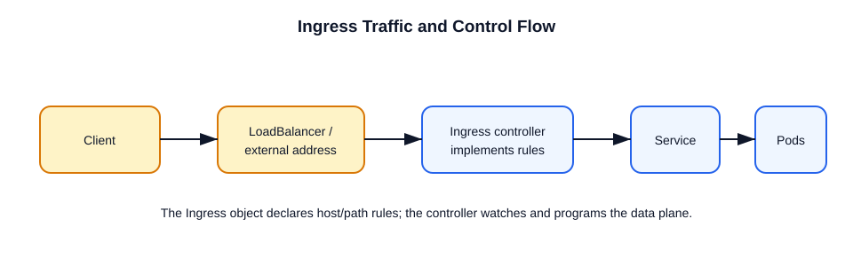

# Ingress vs Ingress Controller

This file explains the difference between Ingress resources and Ingress controllers, and how to configure them.



## Ingress resource
- A Kubernetes object that defines rules for HTTP/S routing.
- It is declarative and contains host/path mappings to services.
- Example:
```yaml
apiVersion: networking.k8s.io/v1
kind: Ingress
metadata:
  name: my-app-ingress
spec:
  rules:
  - host: example.com
    http:
      paths:
      - path: /
        pathType: Prefix
        backend:
          service:
            name: my-service
            port:
              number: 80
```

## Ingress controller
- The implementation that watches Ingress resources.
- It configures a proxy or load balancer to route external traffic.
- Examples: NGINX Ingress Controller, Traefik, HAProxy, Istio Gateway.

## How to configure
1. Install an Ingress controller in the cluster.
2. Create an Ingress resource with routing rules.
3. The controller updates its proxy configuration automatically.
4. External traffic reaches the controller and is forwarded to services.

## Important points
- Ingress is a rule object, not the traffic processor.
- You must deploy a compatible Ingress controller.
- Some controllers support TLS, rewrites, and authentication.
- Ingress controllers may also require a Service of type `LoadBalancer` or `NodePort`.
- For new designs, also evaluate Gateway API: it is a more expressive, role-oriented API, while Ingress remains widely used for HTTP/S routing.

## Interview troubleshooting order

1. Confirm the controller is running and has an external address.
2. Check `ingressClassName` and controller events with `kubectl describe ingress <name>`.
3. Verify the Service port and its EndpointSlices (`kubectl get endpointslice`).
4. Test the Service from inside the cluster before debugging DNS, TLS, host, or path rules.
