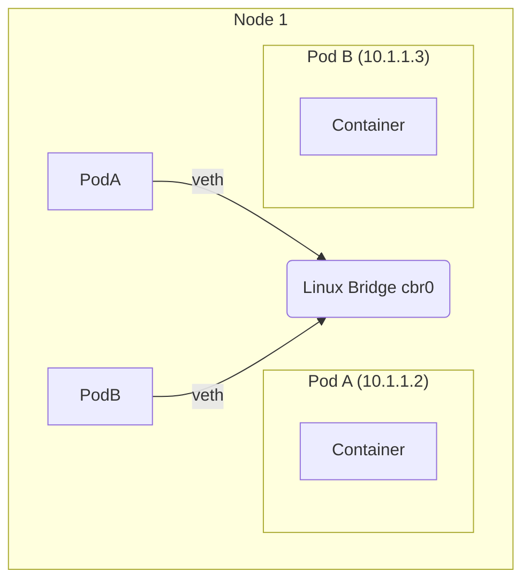
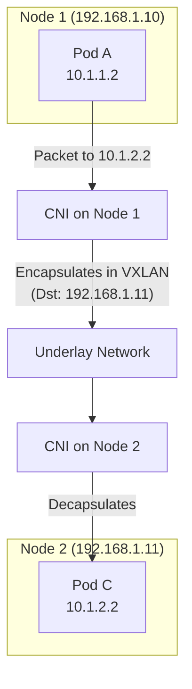

# Pod-to-Pod Communication

This document explains the different ways pods communicate with each other in Kubernetes, which is a fundamental aspect of the cluster's networking model. The model requires that every pod has a unique IP address and can communicate with every other pod in the cluster without NAT (Network Address Translation).

---

## Scenario 1: Communication Between Containers in the Same Pod

Containers within a single Pod share the same network namespace. This means they share an IP address and port space.

-   **Mechanism**: They can communicate with each other using `localhost`.
-   **Use Case**: This is the model used by **sidecar containers**. For example, a service mesh proxy (like Envoy or Linkerd) can intercept all traffic for the main application container, or a logging agent can tail log files from a shared volume.
-   **Communication Methods**:
    -   **Networking**: Via `localhost` (e.g., `curl localhost:8080`).
    -   **Shared Volumes**: Using a shared `emptyDir` or other volume type to read and write files.
    -   **Process Namespace Sharing**: One container can signal or inspect processes in another container if `shareProcessNamespace: true` is set.

```mermaid
graph TD
    subgraph Pod (IP: 10.1.1.2)
        direction LR
        App[App Container] -- "localhost:8080" --> Proxy[Proxy Sidecar]
        Proxy -- "localhost:9000" --> App
        subgraph "Shared Filesystem"
            SharedVolume[emptyDir Volume]
        end
        App -- "Writes logs" --> SharedVolume
        Proxy -- "Reads logs" --> SharedVolume
    end
```

---

## Scenario 2: Communication Between Pods on the Same Node

When two pods are on the same node, their communication is handled by a virtual Ethernet bridge on the node.

-   **Mechanism**: Each pod has its own network namespace and a virtual Ethernet device (`veth`). This device is connected to a bridge (often named `cbr0` or similar) in the node's root network namespace. When Pod A sends a packet to Pod B's IP, the packet goes from Pod A's `veth` to the bridge, which then forwards it directly to Pod B's `veth`.
-   **Efficiency**: This communication is very efficient as it never leaves the node.



---

## Scenario 3: Communication Between Pods on Different Nodes

This is the most complex scenario and is the primary responsibility of the **CNI (Container Network Interface) plugin** (e.g., Calico, Flannel, Cilium).

-   **Mechanism**: An **overlay network** is typically used.
    1.  Pod A on Node 1 sends a packet to Pod C's IP (10.1.2.2) on Node 2.
    2.  The packet leaves Pod A's namespace and hits the root namespace on Node 1.
    3.  The node's routing table (managed by the CNI plugin) determines that the destination IP `10.1.2.2` is on Node 2.
    4.  The CNI plugin **encapsulates** the packet (e.g., using VXLAN or IP-in-IP) with Node 2's IP as the new destination.
    5.  The encapsulated packet travels over the underlying physical network from Node 1 to Node 2.
    6.  Node 2 receives the packet, **decapsulates** it, and sees the original packet destined for Pod C.
    7.  Node 2's local routing rules forward the packet to Pod C's network namespace.

