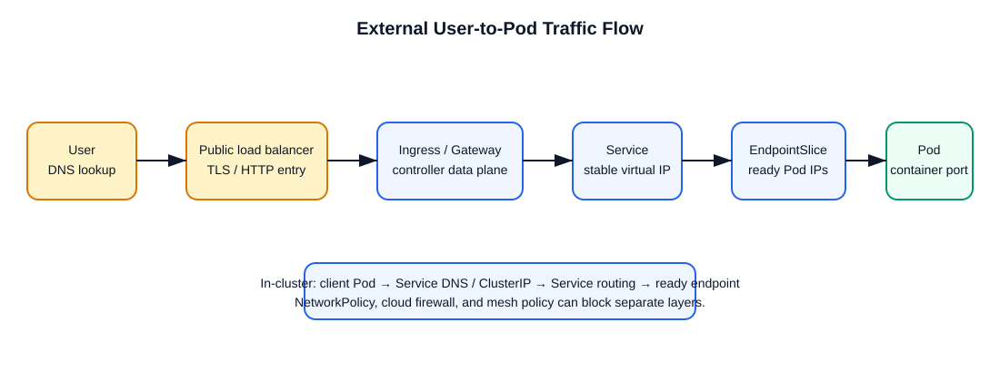

# User-to-Pod Traffic Flow

## Short interview answer

For external HTTP/S traffic, the usual path is: **user DNS → public load balancer → Ingress or Gateway controller → Kubernetes Service → ready EndpointSlice endpoint → Pod IP and container port**. The Ingress/Gateway resource declares rules; its controller implements the data plane. A Service selects ready Pods, and the endpoint data tells the proxy or kube-proxy where to send traffic.



## External request, step by step

1. The user resolves `app.example.com` in public DNS to a load-balancer address.
2. The cloud load balancer or edge proxy forwards TLS/HTTP traffic to an Ingress controller or Gateway implementation in the cluster.
3. The controller matches the host, path, headers, and TLS configuration from Ingress, Gateway API, or mesh configuration.
4. It forwards traffic to the referenced Kubernetes Service and port.
5. The Service selects matching **Ready** Pods. The EndpointSlice controller publishes their Pod IPs and ports as endpoints.
6. The data plane chooses a ready endpoint and sends traffic to the node/Pod network. Depending on the implementation, the Ingress proxy can use endpoints directly or traffic can traverse Service routing implemented by kube-proxy/eBPF.
7. The Pod receives traffic on `containerPort`; if it has multiple containers, they share the Pod network namespace.

## In-cluster request

```text
Client Pod → CoreDNS resolves service.namespace.svc.cluster.local
           → Service ClusterIP
           → kube-proxy or eBPF Service routing
           → ready EndpointSlice endpoint → target Pod
```

For direct Pod-to-Pod traffic, the CNI provides the network path. For a Service, `kube-proxy` or an eBPF data plane translates the virtual Service address to a chosen endpoint. `kube-proxy` is not normally in the data path as a user-space proxy; it programs routing rules.

## Complete Service and Ingress example

The Deployment must expose a container port named `http`, and the Service selector must exactly match the Pod-template label.

```yaml
apiVersion: v1
kind: Service
metadata:
  name: web
  namespace: production
  labels: { app.kubernetes.io/name: web }
spec:
  type: ClusterIP
  selector: { app.kubernetes.io/name: web }
  ports:
  - name: http
    protocol: TCP
    port: 80
    targetPort: http
---
apiVersion: networking.k8s.io/v1
kind: Ingress
metadata:
  name: web
  namespace: production
  annotations: {}
spec:
  ingressClassName: nginx
  tls:
  - hosts: [app.example.com]
    secretName: web-tls
  rules:
  - host: app.example.com
    http:
      paths:
      - path: /
        pathType: Prefix
        backend:
          service:
            name: web
            port: { name: http }
```

## Where managed Kubernetes differs

- **EKS:** an AWS load balancer is commonly created/configured by the AWS Load Balancer Controller; Pod networking is commonly provided by the Amazon VPC CNI.
- **GKE:** the GKE load-balancing and networking implementations provide the edge/data-plane integration; mode and feature choices influence behavior.
- **AKS:** Azure load-balancing, application-routing/ingress options, and the selected Azure network plugin determine the edge and Pod-network path.

The Kubernetes objects remain the same; the cloud integration that implements external addresses and Pod networking differs.

## Debug in order

```sh
# 1. Edge/controller and declared rules
kubectl get ingress,gateway,httproute -A
kubectl describe ingress <name> -n <namespace>

# 2. Service selector, port, and endpoints
kubectl get svc <service> -n <namespace> -o yaml
kubectl get endpointslice -n <namespace> -l kubernetes.io/service-name=<service>
kubectl get pods -n <namespace> -l <selector> -o wide

# 3. Test inside before testing external DNS/TLS
kubectl run netcheck --rm -it --restart=Never --image=busybox:1.36 -- \
  wget -qO- http://<service>.<namespace>.svc.cluster.local:<port>
```

If the EndpointSlice is empty, check the Service selector, Pod labels, readiness probes, and target port. If in-cluster traffic works but external traffic fails, focus on the load balancer, controller, Ingress/Gateway class, DNS, TLS, host/path rule, and cloud firewall/security policy.

## Common misconceptions

- An **Ingress** is a declarative rule; it does not process packets by itself.
- A **Service** is a stable virtual endpoint, not a process that owns the Pods.
- A Pod can be Running but absent from Service endpoints until it is Ready.
- `containerPort` documents/exposes a container port in the Pod spec; it does not expose the application externally.
- NetworkPolicy, security groups/firewalls, and mesh policy can each block traffic at different layers.

## Related notes

- [Ingress vs Ingress Controller](ingress-vs-ingress-controller.md)
- [Services, load balancing, and networking](services-and-networking.md)
- [Istio](../../istio/README.md)
