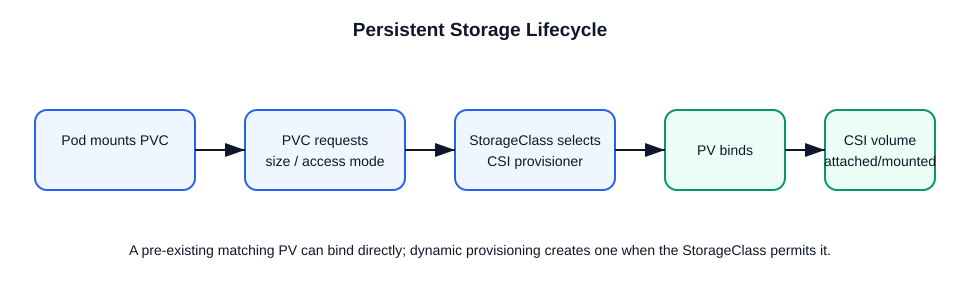

# Storage: PersistentVolume, StorageClass, and PVC

This file explains how persistent storage is provisioned and consumed in Kubernetes.



## PersistentVolume (PV)
- A PV is a cluster resource representing physical storage.
- It is provisioned by an admin or dynamically by a StorageClass.
- It has capacity, access modes, and reclaim policy.

## StorageClass
- Defines how storage is dynamically provisioned.
- Contains a provisioner and volume parameters.
- Example:
```yaml
apiVersion: storage.k8s.io/v1
kind: StorageClass
metadata:
  name: fast-storage
provisioner: ebs.csi.aws.com
parameters:
  type: gp2
```

## PersistentVolumeClaim (PVC)
- A PVC is a request for storage by a pod.
- It specifies size, access modes, and storage class.
- Example:
```yaml
apiVersion: v1
kind: PersistentVolumeClaim
metadata:
  name: my-pvc
spec:
  accessModes:
    - ReadWriteOnce
  resources:
    requests:
      storage: 10Gi
  storageClassName: fast-storage
```

## Flow
1. User creates a PVC.
2. Kubernetes binds the PVC to a matching PV.
3. If using dynamic provisioning, a PV is created automatically.
4. The pod mounts the PVC.

## Important points
- **Dynamic Provisioning Flow**:
  ```mermaid
  sequenceDiagram
      participant User
      participant APIServer as API Server
      participant PVController as PV Controller
      participant CSIDriver as CSI Driver
      participant CloudAPI as Cloud Provider API

      User->>+APIServer: 1. Create PVC
      APIServer-->>-User: PVC is Pending
      APIServer->>+PVController: 2. Notifies of new PVC
      PVController->>+CSIDriver: 3. Instructs to CreateVolume
      CSIDriver->>+CloudAPI: 4. Provisions storage (e.g., EBS Volume)
      CloudAPI-->>-CSIDriver: Returns Volume ID
      CSIDriver->>+PVController: 5. Creates PV object with Volume ID
      PVController->>+APIServer: 6. Binds PV to PVC
      APIServer-->>User: PVC becomes Bound
  ```
- PV is storage; PVC is the claim.
- StorageClass controls dynamic provisioning.
- Modern clusters normally use a CSI driver (for example, the AWS EBS CSI driver) rather than legacy in-tree provisioners.
- `ReadWriteOnce` means mounted by one node at a time.
- `ReadOnlyMany` and `ReadWriteMany` enable multi-node access when supported.
- Reclaim policy matters: `Delete` removes dynamically provisioned backing storage when the claim is released; `Retain` preserves it for manual recovery.
- `volumeBindingMode: WaitForFirstConsumer` delays provisioning/binding until the scheduler selects a node, which helps topology-aware volumes.

## Interview checks

`kubectl get sc,pv,pvc` shows the provisioning and binding state. For a pending PVC, inspect `kubectl describe pvc <name>` for events, then verify the StorageClass, CSI driver, requested access mode, capacity, and topology.
