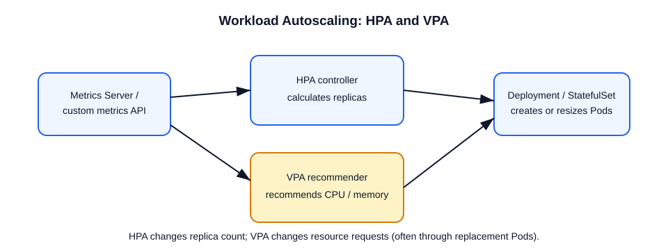

# HPA vs VPA

## Interview answer

- **HPA (Horizontal Pod Autoscaler)** changes the replica count of a scalable workload to meet a CPU, memory, custom, or external metric target.
- **VPA (Vertical Pod Autoscaler)** rightsizes container CPU and memory requests (and, depending on policy, limits) using usage history and recommendations. It is an add-on CRD, not a built-in Kubernetes API resource.



## When to use each

| Need | Prefer | Why |
| --- | --- | --- |
| Serve variable HTTP or queue demand | HPA | More replicas increase throughput and availability. |
| Find realistic CPU and memory requests | VPA in `Off` mode first | It provides recommendations without changing Pods. |
| Stateful or singleton workload | VPA, after testing disruption behavior | Additional replicas may not help or may be unsafe. |
| Application and cluster capacity | HPA plus node autoscaling | HPA creates Pods; node autoscaling adds capacity for Pods that cannot schedule. |

## How HPA decides

For a simple metric, the controller approximates:

`desiredReplicas = ceil(currentReplicas × currentMetric / targetMetric)`

It honors `minReplicas`, `maxReplicas`, tolerance, readiness, missing-metric handling, and any configured scale-up/scale-down behavior. CPU utilization requires resource **requests** so the percentage has a denominator. HPA uses the highest desired replica count when multiple metrics are configured.

## Important trade-offs

- HPA needs a metrics API: usually Metrics Server for resource metrics, or an adapter for custom/external metrics.
- VPA needs a metrics source and its controller components. Its updater can evict Pods so replacements receive updated requests; configure a PodDisruptionBudget and test availability.
- Do not let HPA and VPA simultaneously control the same CPU or memory request signal without deliberate design. A safe default is VPA recommendation-only mode together with HPA.
- HPA does not make a DaemonSet horizontally scalable.

Examples:
- HPA (CPU-based):
```yaml
apiVersion: autoscaling/v2
kind: HorizontalPodAutoscaler
metadata:
  name: web-hpa
spec:
  scaleTargetRef:
    apiVersion: apps/v1
    kind: Deployment
    name: web-deploy
  minReplicas: 2
  maxReplicas: 10
  metrics:
  - type: Resource
    resource:
      name: cpu
      target:
        type: Utilization
        averageUtilization: 60
```

- VPA (example, using the VPA CRD):
```yaml
apiVersion: autoscaling.k8s.io/v1
kind: VerticalPodAutoscaler
metadata:
  name: web-vpa
spec:
  targetRef:
    apiVersion: "apps/v1"
    kind: Deployment
    name: web-deploy
  updatePolicy:
    updateMode: "Off" # Recommendation-only
```

Notes:
- Check `kubectl get hpa` and `kubectl describe hpa <name>` for metric and scaling conditions.
- Monitor disruption and recommendations before enabling automated VPA updates.
- Test scaling behavior under load; include resource requests/limits in performance tests.

## Official references

- [Horizontal Pod Autoscaling](https://kubernetes.io/docs/concepts/workloads/autoscaling/horizontal-pod-autoscale/)
- [Vertical Pod Autoscaling](https://kubernetes.io/docs/concepts/workloads/autoscaling/vertical-pod-autoscale/)
