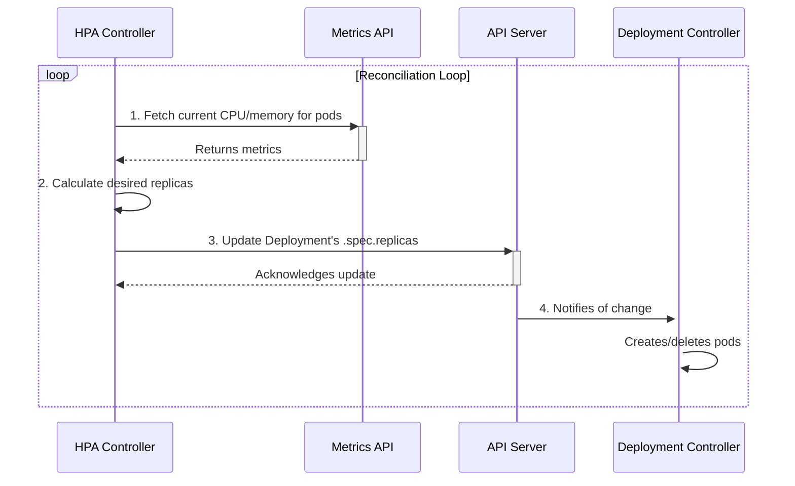

# Horizontal Pod Autoscaler (HPA)

The **Horizontal Pod Autoscaler (HPA)** automatically scales the number of pod replicas in a Deployment, ReplicaSet, or StatefulSet based on observed metrics. Its primary goal is to match the number of pods to the current workload demand.

## How it Works: The Control Loop

The HPA is implemented as a control loop that runs inside the `kube-controller-manager`.

1.  **Fetch Metrics**: Periodically, the HPA controller queries the **Metrics API** (`metrics.k8s.io`) to get the current CPU or memory usage for the pods it targets. For custom metrics, it queries the `custom.metrics.k8s.io` or `external.metrics.k8s.io` APIs.
2.  **Calculate Desired Replicas**: It compares the current metric value against the target value defined in the HPA manifest and calculates the desired number of replicas using a ratio. The formula is:
    `desiredReplicas = ceil[currentReplicas * ( currentMetricValue / desiredMetricValue )]`
3.  **Scale the Target**: If the desired number of replicas is different from the current number, the HPA updates the `replicas` field on the scale subresource of the target workload (e.g., the Deployment).
4.  **Reconciliation**: The Deployment controller then sees the change in desired replicas and creates or terminates pods to match the new count.



## Example: Scaling on CPU Utilization

This HPA targets a Deployment named `my-webapp` and aims to keep the average CPU utilization across all its pods at 50%. It will scale between 2 and 10 replicas.

```yaml
apiVersion: autoscaling/v2
kind: HorizontalPodAutoscaler
metadata:
  name: my-webapp-hpa
spec:
  scaleTargetRef:
    apiVersion: apps/v1
    kind: Deployment
    name: my-webapp
  minReplicas: 2
  maxReplicas: 10
  metrics:
  - type: Resource
    resource:
      name: cpu
      target:
        type: Utilization
        averageUtilization: 50
```

## Important Considerations

-   **Metrics Server is Required**: For resource metrics (CPU/memory), the Metrics Server must be installed in the cluster.
-   **Resource Requests are Crucial**: The HPA calculates CPU utilization as `(current usage / requested value)`. If you do not set `spec.containers.resources.requests.cpu` in your Deployment, the HPA cannot calculate utilization and will not work.
-   **Cooldown Period**: To prevent rapid scaling "flapping," the HPA has configurable cooldown periods for both scale-up and scale-down events. The default is 3 minutes for scale-up and 5 minutes for scale-down.
-   **Multiple Metrics**: The HPA can scale based on multiple metrics. It will calculate the desired replica count for each metric and pick the largest one.