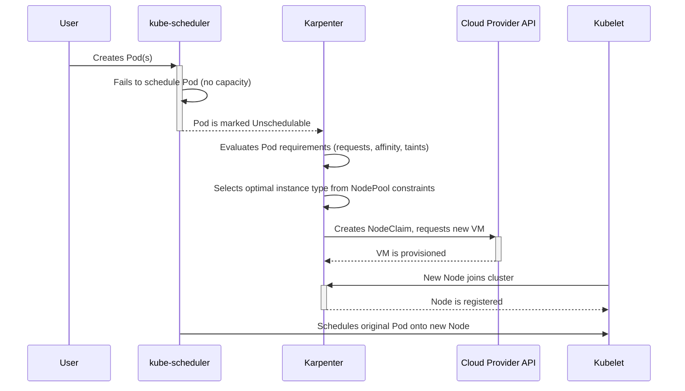

# Karpenter

## What it is

Karpenter is a flexible, high-performance Kubernetes cluster autoscaler. It rapidly provisions new nodes in response to unschedulable pods, choosing the most efficient and cost-effective instance types that meet workload requirements. It complements workload autoscaling: HPA creates Pods; Karpenter adds nodes when those Pods cannot fit.

## Core Objects

- **NodePool:** scheduling and disruption policy—requirements, limits, labels, taints, weight, and consolidation behavior.
- **NodeClaim:** a concrete node request created from a NodePool.
- **Provider-specific node class:** infrastructure configuration. On AWS this is typically `EC2NodeClass`, which selects IAM role, AMIs, subnets, security groups, and block-device settings.

## How the flow works

This diagram shows the provisioning workflow:



1.  **Unschedulable Pods**: The `kube-scheduler` fails to schedule pods due to insufficient capacity.
2.  **Karpenter Reacts**: Karpenter's controller sees the pending pods.
3.  **Instance Selection**: It evaluates the pod's requirements (resources, affinity, tolerations) and selects the best instance type from the cloud provider that fits the constraints defined in the `NodePool`.
4.  **Provisioning**: Karpenter creates a `NodeClaim` and directly calls the cloud provider's API to launch the node.
5.  **Node Joins**: The new node starts, its `kubelet` joins the cluster, and it becomes `Ready`.
6.  **Scheduling**: The `kube-scheduler` places the pending pods onto the new node.

## Essential commands

```sh
kubectl get nodepools
kubectl get nodeclaims
kubectl describe nodepool <name>
kubectl describe nodeclaim <name>
kubectl get events -A --sort-by=.lastTimestamp
kubectl logs -n kube-system deploy/karpenter --tail=200
```

Installation normally uses Helm and needs cloud-provider-specific IAM, discovery tags, and interruption/event configuration. Do not copy an installation command across accounts or clusters without adapting those prerequisites.

## Complete AWS example

This dynamic NodePool shows the important fields commonly used in production. The IAM role, discovery tags, region, zones, AMI alias, and limits must be adapted for the account. Do not set `replicas` together with `weight` for a dynamic pool.

```yaml
apiVersion: karpenter.k8s.aws/v1
kind: EC2NodeClass
metadata:
  name: default
spec:
  amiFamily: AL2023
  role: KarpenterNodeRole-<cluster-name>
  subnetSelectorTerms:
  - tags: { karpenter.sh/discovery: <cluster-name> }
  securityGroupSelectorTerms:
  - tags: { karpenter.sh/discovery: <cluster-name> }
  amiSelectorTerms:
  - alias: al2023@latest
---
apiVersion: karpenter.sh/v1
kind: NodePool
metadata:
  name: applications
spec:
  template:
    metadata:
      labels: { workload: applications }
    spec:
      nodeClassRef:
        group: karpenter.k8s.aws
        kind: EC2NodeClass
        name: default
      expireAfter: 720h
      terminationGracePeriod: 48h
      requirements:
      - key: kubernetes.io/arch
        operator: In
        values: [amd64]
      - key: kubernetes.io/os
        operator: In
        values: [linux]
      - key: karpenter.sh/capacity-type
        operator: In
        values: [on-demand]
      - key: karpenter.k8s.aws/instance-category
        operator: In
        values: [c, m, r]
      - key: karpenter.k8s.aws/instance-generation
        operator: Gt
        values: ["3"]
      - key: topology.kubernetes.io/zone
        operator: In
        values: [<region>a, <region>b]
  disruption:
    consolidationPolicy: WhenEmptyOrUnderutilized
    consolidateAfter: 5m
    budgets:
    - nodes: 10%
  limits:
    cpu: "200"
    memory: 400Gi
  weight: 10
```

## Important features and trade-offs

- Fits instance type, zone, architecture, capacity type, and resource requirements to waiting Pods.
- Can consolidate or replace underutilized nodes according to disruption policy.
- Works best with accurate Pod resource requests and clear workload constraints.
- Must respect PDBs, topology constraints, attached volumes, and termination handling; otherwise cost optimization can become availability risk.
- Keep a stable system node pool or equivalent capacity strategy so the autoscaler itself and core add-ons remain available.

## Interview distinction

Cluster Autoscaler generally adjusts predefined node groups; Karpenter can select and provision capacity directly from flexible infrastructure constraints. Both react to unschedulable Pods, not application traffic directly.

## Official references

- [Karpenter documentation](https://karpenter.sh/docs/)
- [Karpenter concepts](https://karpenter.sh/docs/concepts/)
